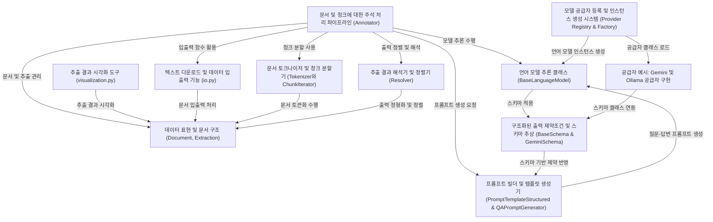

# Tutorial: langextract

LangExtract는 **자연어 텍스트에서 구조화된 정보를 추출**하기 위한 *언어 모델 기반 추출 파이프라인*입니다.  
이 프로젝트는 입력 문서를 **토큰화하고 청크 단위로 분할**하여, 다양한 언어 모델 공급자를 통해 모델 추론을 수행합니다.  
또한, 모델 출력 결과를 **JSON/YAML 형태로 해석 및 정렬**하여, 원본 텍스트 위에 정확히 위치시킬 수 있습니다.  
결과적으로, 추출된 정보를 **사용자 친화적인 시각화 도구로 하이라이트**하고, 데이터를 파일로 저장하거나 불러올 수 있는 편의 기능을 포함합니다.  
LangExtract는 **상호 운용성이 뛰어난 구조와 추상화 레이어**를 제공하여, 확장성과 다양한 모델 연동을 지원합니다.

**Source Repository:** [https://github.com/google/langextract](https://github.com/google/langextract)

## Chapters

1. [데이터 표현 및 문서 구조 (Document, Extraction)
](01_데이터_표현_및_문서_구조__document__extraction__.md)
2. [텍스트 다운로드 및 데이터 입출력 기능 (io.py)
](02_텍스트_다운로드_및_데이터_입출력_기능__io_py__.md)
3. [문서 토크나이저 및 청크 분할기 (Tokenizer와 ChunkIterator)
](03_문서_토크나이저_및_청크_분할기__tokenizer와_chunkiterator__.md)
4. [문서 및 청크에 대한 주석 처리 파이프라인 (Annotator)
](04_문서_및_청크에_대한_주석_처리_파이프라인__annotator__.md)
5. [프롬프트 빌더 및 템플릿 생성기 (PromptTemplateStructured & QAPromptGenerator)
](05_프롬프트_빌더_및_템플릿_생성기__prompttemplatestructured___qapromptgenerator__.md)
6. [모델 공급자 등록 및 인스턴스 생성 시스템 (Provider Registry & Factory)
](06_모델_공급자_등록_및_인스턴스_생성_시스템__provider_registry___factory__.md)
7. [공급자 예시: Gemini 및 Ollama 공급자 구현
](07_공급자_예시__gemini_및_ollama_공급자_구현_.md)
8. [구조화된 출력 제약조건 및 스키마 추상 (BaseSchema & GeminiSchema)
](08_구조화된_출력_제약조건_및_스키마_추상__baseschema___geminischema__.md)
9. [언어 모델 추론 클래스 (BaseLanguageModel)
](09_언어_모델_추론_클래스__baselanguagemodel__.md)
10. [추출 결과 해석기 및 정렬기 (Resolver)
](10_추출_결과_해석기_및_정렬기__resolver__.md)
11. [추출 결과 시각화 도구 (visualization.py)
](11_추출_결과_시각화_도구__visualization_py__.md)

---
