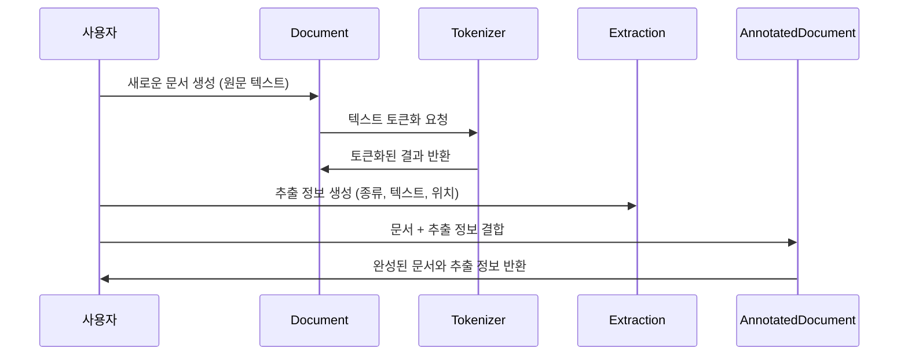

# Chapter 1: 데이터 표현 및 문서 구조 (Document, Extraction)

---

## 1. 시작하며  

텍스트에서 필요한 정보를 뽑아내는 작업을 해본 적 있나요? 예를 들어, 뉴스 기사에서 사람 이름, 날짜, 장소 같은 중요한 부분만 쏙쏙 뽑아내고 싶다면 어떻게 해야 할까요? 텍스트는 그냥 긴 문자들의 나열이지만, 그 안에는 우리가 필요한 '구조화된 정보'가 숨어 있습니다.  

이 챕터에서는 **원본 텍스트**와 그 텍스트에서 **추출한 정보**를 깔끔하고 쉽게 관리할 수 있게 도와주는 핵심 데이터 구조인 `Document`와 `Extraction`을 배웁니다. 마치 책과 책갈피, 그리고 메모를 함께 사용하는 것처럼 텍스트와 정보를 편리하게 다룰 수 있습니다.

---

## 2. 왜 데이터 표현과 문서 구조가 중요한가?  

원본 텍스트를 그냥 문자열로만 다루면, 원하는 정보를 관리하거나 재사용하기가 매우 어렵습니다. 예를 들어, "홍길동은 2023년 1월 1일에 서울에서 태어났다." 같은 문장에서  

- "홍길동" (사람 이름)  
- "2023년 1월 1일" (날짜)  
- "서울" (장소)  

이렇게 중요한 정보들을 따로 저장하고 위치를 기억해야 한다면, 단순 문자열은 한계가 많습니다.  

그래서 `Document`와 `Extraction`이라는 **데이터 구조**를 사용해 텍스트와 추출된 정보를 함께, 체계적으로 저장합니다.

---

## 3. 핵심 개념: Document와 Extraction

### 3-1. Document (문서)  

`Document`는 원본 텍스트를 담는 그릇입니다. 텍스트뿐만 아니라, 토큰(token)으로 나눈 정보와 문서 고유 ID, 그리고 문서와 관련된 추가 정보까지 포함할 수 있어요.  

- **text**: 원본 텍스트  
- **document_id**: 문서 고유 아이디 (없으면 자동으로 생성)  
- **additional_context**: 필요한 보조 정보  
- **tokenized_text**: 텍스트를 단어 등으로 쪼갠 토큰 정보 (자동 생성됨)  

예를 들어,  
```python
doc = Document(text="홍길동은 2023년 1월 1일에 서울에서 태어났다.")
print(doc.document_id)  # 자동 생성된 고유 ID 출력
print(doc.tokenized_text)  # 토큰화 결과 출력
```

문서 객체는 원본 텍스트를 담고, 내부적으로 쉽게 작업할 수 있게 토큰화 정보를 준비합니다.

---

### 3-2. Extraction (추출 정보)  

`Extraction`은 문서 내에서 뽑아낸 중요한 정보를 담습니다. 예를 들어 사람 이름, 날짜, 장소 같은 개별 정보가 이에 해당합니다.  

각 Extraction은 다음 속성을 갖고 있어요:  

- **extraction_class**: 정보의 종류 (예: "인물", "날짜", "장소")  
- **extraction_text**: 추출된 실제 텍스트 (예: "홍길동")  
- **char_interval**: 원본 텍스트에서 시작과 끝 문자 위치  
- **token_interval**: 토큰 기준 위치  
- **alignment_status**: 텍스트 정렬 상태  
- **attributes**: 추가 메타정보 (예: 상세 속성들)  

예를 들어,    
```python
from langextract.data import CharInterval, Extraction

extraction = Extraction(
    extraction_class="인물",
    extraction_text="홍길동",
    char_interval=CharInterval(start_pos=0, end_pos=3)
)
print(extraction.extraction_text)  # '홍길동' 출력
```

이렇게 추출된 정보를 `Document`와 연결하면, 원본 텍스트 어디에서 어떤 정보가 뽑혔는지 쉽게 알 수 있습니다.

---

## 4. 실제 사용 예제  

문서부터 만들고, 그 안에 추출 정보를 추가하는 간단한 과정을 살펴보겠습니다.  

```python
# 1. 문서 생성
doc = Document(text="홍길동은 2023년 1월 1일에 서울에서 태어났다.")

# 2. 인물 추출 생성
person = Extraction(
    extraction_class="인물",
    extraction_text="홍길동",
    char_interval=CharInterval(start_pos=0, end_pos=3)
)

# 3. 날짜 추출 생성
date = Extraction(
    extraction_class="날짜",
    extraction_text="2023년 1월 1일",
    char_interval=CharInterval(start_pos=4, end_pos=15)
)

# 4. 추출 리스트 생성 및 문서에 담기 (AnnotatedDocument 활용 가능)
from langextract.data import AnnotatedDocument

annotated_doc = AnnotatedDocument(
    text=doc.text,
    extractions=[person, date],
)
```

이 과정을 통해 원본 텍스트와, 그 속에서 발견한 중요한 정보(인물, 날짜 등)를 한 곳에서 관리할 수 있습니다.

---

## 5. 내부 동작 흐름 이해하기  

`Document`와 `Extraction` 데이터 구조는 어떻게 동작할까요?  

> ### 단계별 흐름 (간단 시퀀스 다이어그램)



1. 사용자가 원본 텍스트로 `Document` 객체를 만듭니다.
2. `Document`는 내부에서 `Tokenizer`를 호출하여 텍스트를 단어 단위로 나눕니다.
3. 사용자는 추출할 정보를 `Extraction` 객체로 생성합니다. 이때 텍스트 내 위치(문자 인덱스 등)를 지정합니다.
4. `AnnotatedDocument` 같은 구조체에 `Document`와 `Extraction`을 묶어서 관리할 수 있습니다.
5. 사용자는 이 데이터 구조를 활용해 효율적으로 정보 추출을 수행하거나 결과를 다룰 수 있습니다.

---

## 6. 내부 코드 간단히 살펴보기  

실제 파일 `langextract/data.py`에는 다음과 같은 클래스가 있습니다.  

```python
@dataclasses.dataclass
class Document:
    text: str
    # 기타 필드...

    @property
    def tokenized_text(self):
        if self._tokenized_text is None:
            self._tokenized_text = tokenizer.tokenize(self.text)
        return self._tokenized_text
```

- `Document` 클래스는 `text` 필드를 받아 저장합니다.
- `tokenized_text` 속성을 처음 호출하면 자동으로 텍스트를 토큰화합니다.
- 이 토큰화 정보는 다시 텍스트 위치 추적 등에 도움이 됩니다.

`Extraction` 클래스는 다음과 같은 구조입니다.

```python
@dataclasses.dataclass(init=False)
class Extraction:
    extraction_class: str
    extraction_text: str
    char_interval: CharInterval | None = None
    # 기타 속성들...
```

- `extraction_class`와 `extraction_text`는 필수입니다.
- 원본 텍스트 상 위치(문자, 토큰)를 함께 저장해서 어디서 추출된지 알 수 있게 합니다.

---

## 7. 비유로 이해하기  

- **Document**는 책 한 권과 같습니다.  
- **Extraction**은 책갈피와 메모지라고 생각하면 쉬워요. 책갈피가 ‘이 부분이 중요!’라고 위치를 표시하고, 메모지는 ‘이 내용은 사람 이름이에요’ 같은 정보를 적어둡니다.  
- 이렇게 함께 관리하면 나중에 원하는 정보를 쉽고 정확하게 찾아낼 수 있겠죠?  

---

## 8. 이번 장 요약 및 다음 장 연결  

이번 장에서는 텍스트 데이터에서 핵심이 되는 `Document`와 `Extraction`이라는 데이터 구조를 배웠습니다.  
원본 텍스트를 관리하는 `Document`와 그 문서에서 손쉽게 정보를 뽑아내고 위치와 종류를 표시하는 `Extraction`은 정보 추출 파이프라인에서 빼놓을 수 없는 기본 뼈대입니다.  

다음 장에서는 이번에 배운 이 문서 구조를 활용해 **텍스트 다운로드, 파일 입출력** 등을 어떻게 처리하는지 살펴볼 거예요.  
텍스트 데이터를 직접 다루며 `Document` 객체를 생성하고 저장하는 실제 작업을 경험해봅시다!  

[다음 장 보기: 텍스트 다운로드 및 데이터 입출력 기능 (io.py)](02_텍스트_다운로드_및_데이터_입출력_기능__io_py__.md)  

---

### 감사합니다! 다음 장에서 만나요 :)

---
