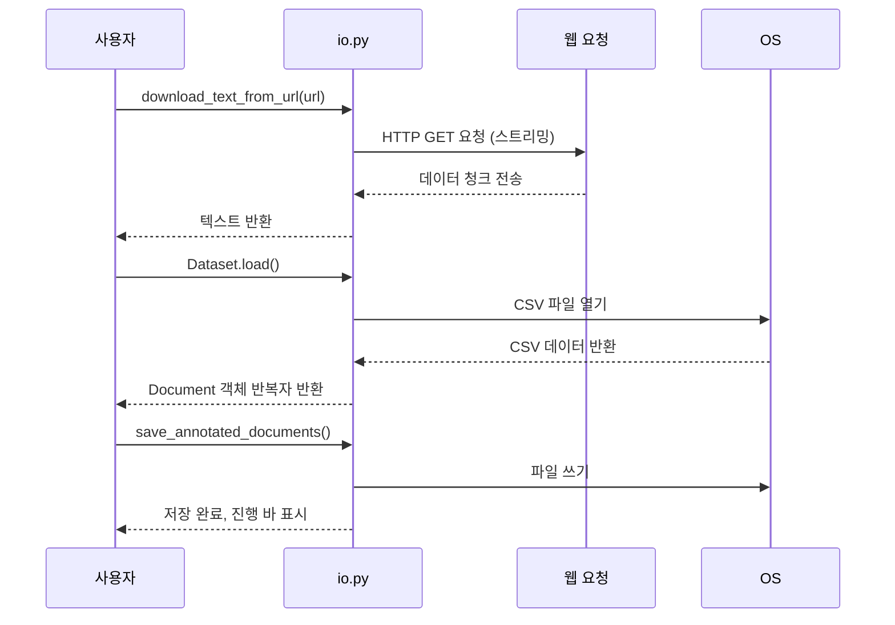

# Chapter 2: 텍스트 다운로드 및 데이터 입출력 기능 (io.py)

---

## 1. 이전 장과 이어서

앞서 [데이터 표현 및 문서 구조 (Document, Extraction)](01_데이터_표현_및_문서_구조__document__extraction__.md) 장에서 문서와 추출 정보의 기본 개념을 배웠습니다. 이번 장에서는 문서에 담을 텍스트를 외부에서 어떻게 가져오고, 컴퓨터에 저장하거나 불러오는 방법을 쉽게 처리하는 `io.py` 모듈의 핵심 기능들을 알아보겠습니다.

---

## 2. 왜 텍스트 다운로드와 데이터 입출력이 필요한가?

우리가 텍스트 데이터로 작업할 때 가장 먼저 할 일은 '필요한 텍스트를 얻는 것'입니다. 예를 들어 뉴스 기사를 인터넷에서 다운로드 하거나, CSV 파일 같은 표 형식 데이터에서 텍스트를 읽어오는 경우가 많습니다. 그리고 쓸모 있는 정보를 뽑아낸 뒤에는 그 결과를 별도 파일로 저장해 다시 쓸 수 있어야 하죠.

매번 복잡한 코드 없이, 텍스트 데이터를 쉽게 가져오고 저장할 수 있다면 훨씬 편리하겠죠? 그래서 `io.py` 모듈은  

- **웹(URL)에서 텍스트 다운로드**  
- **CSV 파일 읽기**  
- **JSONL 형식(텍스트 라인마다 JSON) 저장 및 불러오기**  

를 자동화해 줍니다. 그리고 사용자에게 현재 진행 상황을 알려주는 안내 메시지와 진행 바(progress bar)를 포함해, 작업 상태를 한눈에 알기 쉽게 보여줍니다.

---

## 3. 핵심 기능 하나하나 살펴보기

### 3-1. URL에서 텍스트 다운로드하기

웹 페이지나 서버에 저장된 텍스트를 자동으로 내려받고 싶을 때 사용합니다. 예를 들어, 뉴스 기사나 오픈 API에서 텍스트 정보를 얻고자 할 때 쓰죠.

```python
from langextract.io import download_text_from_url

url = "https://example.com/sample.txt"
text = download_text_from_url(url)
print(text[:100])  # 다운로드한 텍스트 앞 부분 출력
```

- `download_text_from_url`은 URL을 입력하면 텍스트를 **자동으로 내려받아** 리턴합니다.  
- 다운로드 중에는 진행 상황이 바 형태로 화면에 표시되어, 얼마나 받았는지 알 수 있어요.  
- 만약 텍스트 형식이 아닌 이미지나 바이너리라면 경고 메시지를 보여주기도 합니다.

---

### 3-2. CSV 파일에서 문서 데이터 읽기

예를 들어 사용자 데이터나 뉴스 기사 목록이 CSV 파일에 있을 때, 특정 열을 골라서 `Document` 객체로 바꿔줍니다.

```python
from langextract.io import Dataset

dataset = Dataset(
    input_path="data/sample.csv",
    id_key="id",
    text_key="content"
)

for doc in dataset.load():
    print(doc.document_id, doc.text[:50])  # 각 문서 ID와 텍스트 앞부분 출력
```

- `Dataset` 클래스는 CSV 파일 경로, 문서 ID가 저장된 열 이름, 텍스트가 저장된 열 이름을 입력으로 받습니다.  
- `load()` 메서드는 CSV 파일을 읽고 각 행을 `Document` 객체로 만들어 차례로 돌려줍니다.  
- CSV가 비어있거나 파일이 없으면 예외를 발생시킵니다.

---

### 3-3. 추출된 문서(AnnotatedDocument) 저장하기 (JSONL 포맷)

`Document`에서 추출한 정보(예: 사람 이름, 날짜 등)를 포함하는 `AnnotatedDocument` 컬렉션을 JSONL(한 줄마다 JSON 데이터) 파일로 저장합니다.

```python
from langextract.io import save_annotated_documents

# annotated_documents는 AnnotatedDocument 객체의 이터레이터라고 가정
save_annotated_documents(annotated_documents, output_dir="output", output_name="result.jsonl")
```

- 저장 중에도 진행 바가 표시되어 몇 개가 저장되었는지 볼 수 있습니다.  
- 저장할 폴더가 없으면 자동으로 만들어 줍니다.  
- 저장할 데이터가 없으면 경고를 줍니다.

---

### 3-4. JSONL 형식 문서 불러오기

나중에 저장해 둔 JSONL 파일을 다시 읽어서 `AnnotatedDocument` 객체로 복원할 수 있습니다.

```python
from langextract.io import load_annotated_documents_jsonl

for annotated_doc in load_annotated_documents_jsonl("output/result.jsonl"):
    print(annotated_doc.document_id, annotated_doc.extractions)
```

- 파일이 없으면 오류가 납니다.  
- 읽는 동안 진행 바가 보여서 상태를 알기 쉽습니다.

---

## 4. 실제 사용 사례 따라하기

> **예시**: 인터넷 URL에서 기사 텍스트를 받아와, CSV 데이터로부터 문서를 불러와서, 추출 결과를 JSONL로 저장하기

1) 웹에서 텍스트 다운로드

```python
url = "https://example.com/news_article.txt"
raw_text = download_text_from_url(url)
print("다운받은 텍스트 길이:", len(raw_text))
```

2) CSV에서 문서 불러오기

```python
dataset = Dataset(
    input_path="data/news.csv",
    id_key="article_id",
    text_key="article_text"
)

documents = list(dataset.load())
print(f"읽어온 문서 수: {len(documents)}")
```

3) 추출 결과를 모아 저장하기

```python
# 여기는 예시용으로, 실제 extraction 단계는 다음 장에서 배울 예정
from langextract.data import AnnotatedDocument

annotated_docs = (AnnotatedDocument(text=doc.text, extractions=[]) for doc in documents)

save_annotated_documents(annotated_docs, output_dir="output", output_name="annotated.jsonl")
print("저장 완료!")
```

---

## 5. 내부 동작 흐름 이해하기

`io.py` 모듈은 어떻게 동작할까요? 각 기능이 호출되면 내부에서 무슨 일이 벌어지는지 간단 시퀀스 다이어그램으로 살펴보겠습니다.



- 웹 요청은 `requests` 라이브러리로 처리하며, 큰 파일도 작은 조각(chunk)씩 받아 효율적입니다.  
- CSV 파일을 읽을 때는 `pandas`가 내부에서 데이터를 깔끔하게 다룹니다.  
- 저장 시에는 JSON으로 직렬화하고, 한 줄씩 써서 나중에 불러오기 쉽게 만듭니다.  
- 진행 바는 `progress` 모듈이 담당해 사용자에게 작업 상태를 시각적으로 알려줍니다.

---

## 6. 내부 코드 살펴보기: 주요 함수와 클래스

### 6-1. URL 텍스트 다운로드 함수 (download_text_from_url)

```python
def download_text_from_url(url: str) -> str:
    response = requests.get(url, stream=True, timeout=30)
    response.raise_for_status()
    chunks = []
    for chunk in response.iter_content(chunk_size=8192):
        if chunk:
            chunks.append(chunk)
    content = b''.join(chunks)
    # 여러 인코딩 시도를 거쳐 텍스트 변환
    text = content.decode('utf-8')
    return text
```

- `requests.get`의 `stream=True` 옵션을 이용해 데이터를 조금씩 받아옵니다.  
- 데이터 청크를 모은 후 한번에 `bytes`를 합쳐 텍스트로 만듭니다.  
- UTF-8, Latin-1 등 여러 인코딩을 시도하며 깨지지 않는 인코딩을 찾는 로직도 포함되어 있습니다.

### 6-2. Dataset 클래스 일부

```python
@dataclasses.dataclass(frozen=True)
class Dataset:
    input_path: pathlib.Path
    id_key: str
    text_key: str

    def load(self):
        if not os.path.exists(self.input_path):
            raise IOError("파일이 존재하지 않습니다.")
        # CSV 파일 읽어 각 행을 Document로 반환
        # pandas DataFrame 활용
        df = pd.read_csv(self.input_path, usecols=[self.text_key, self.id_key], dtype=str)
        for _, row in df.iterrows():
            yield data.Document(text=row[self.text_key], document_id=row[self.id_key])
```

- 경로와 열 이름을 지정하면 CSV를 열어 `Document` 객체를 순차적으로 만들어 줍니다.  
- 파일이 없거나 CSV가 비었으면 적절한 예외를 던집니다.

### 6-3. 저장 함수 일부

```python
def save_annotated_documents(annotated_documents, output_dir, output_name):
    output_dir = pathlib.Path(output_dir)
    output_dir.mkdir(parents=True, exist_ok=True)
    output_file = output_dir / output_name
    with open(output_file, 'w') as f:
        for adoc in annotated_documents:
            if adoc.document_id:
                line = json.dumps(data_lib.annotated_document_to_dict(adoc), ensure_ascii=False)
                f.write(line + '\n')
```

- 폴더가 없으면 새로 만들고, 한 줄씩 JSON으로 저장합니다.  
- `AnnotatedDocument`를 딕셔너리로 변환하는 헬퍼 함수가 내부에서 호출됩니다.

---

## 7. 비유로 쉽게 이해하기

- **텍스트 다운로드**는 우체국에서 편지를 받아오는 과정과 비슷합니다. 온라인에 있는 '편지(URL)'를 요청해서 내용물을 차근차근 받아 집으로 안전하게 가져오는 거죠.  
- **CSV를 읽는 것**은 사무실에서 필요한 서류함을 열어 문서들을 하나씩 꺼내 자료를 보는 과정과 같습니다.  
- **결과 저장(JSONL)은** 책상 위에 각종 문서(추출 결과)를 한 줄씩 정리해 파일 상자에 보관하는 일로 볼 수 있어요. 다음에 다시 꺼내 쓰기 편하게 잘 정리하는 것이 중요합니다.

---

## 8. 이번 장 정리 및 다음 장 예고

이번 장에서는 `langextract` 프로젝트에서 중요한 `io.py` 모듈을 배워보았습니다.  

- **인터넷 URL에서 텍스트를 다운로드하는 방법**  
- **CSV 파일 같은 외부 데이터로부터 문서 객체를 불러오는 방법**  
- **추출 결과를 JSONL 파일로 저장하고, 다시 불러오는 방법**  

등을 익혀 데이터 입출력의 흐름을 이해했죠.

이를 통해 여러분은 실제로 텍스트 데이터를 어디서든 쉽게 가져오고, 정리하여 결과물을 안전하게 저장할 수 있게 되었습니다.

다음 장에서는 이번에 다룬 문서와 데이터를 실제로 가공하는 핵심 도구인 **문서 토크나이저와 청크 분할기**를 배워 봅니다.  
그럼 [문서 토크나이저 및 청크 분할기 (Tokenizer와 ChunkIterator)](03_문서_토크나이저_및_청크_분할기__tokenizer와_chunkiterator__.md) 장에서 만나요!

---

### 감사합니다! 다음 장에서 또 만나요 :)

---
