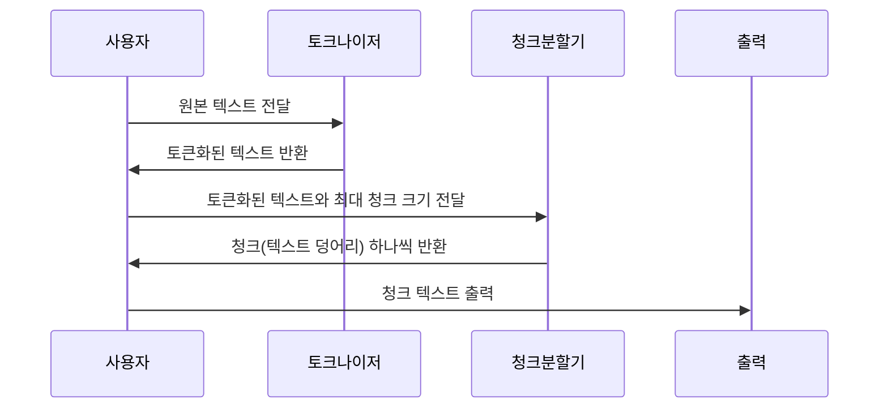

# Chapter 3: 문서 토크나이저 및 청크 분할기 (Tokenizer와 ChunkIterator)

---

## 1. 이전 장과 이어서

지난 장에서는 [텍스트 다운로드 및 데이터 입출력 기능 (io.py)](02_텍스트_다운로드_및_데이터_입출력_기능__io_py__.md)에서 어떻게 텍스트를 가져오고 저장하는지 배웠습니다. 이제 가져온 텍스트를 작은 단위로 나누고, 긴 문서를 여러 조각으로 쪼개는 작업이 필요합니다.  
이번 장에서는 **문서 토크나이저(tokenizer)**와 **청크 분할기(chunk iterator)** 도구를 통해 그 과정을 쉽게 처리하는 방법을 배워보겠습니다.

---

## 2. 문서 토크나이저와 청크 분할기의 필요성은?

우리가 긴 텍스트를 언어 모델에 넣으려면, 너무 길면 한꺼번에 처리할 수 없습니다.  
예를 들어, 소설 한 권을 여러 페이지로 찢어서 조금씩 읽는 것과 비슷합니다.

- 텍스트를 단어, 숫자, 구두점 단위로 쪼개는 일 → **토크나이저(Tokenzier)**  
- 긴 문서를 모델이 원활히 처리할 수 있도록 여러 **청크(덩어리)**로 나누는 일 → **청크 분할기(ChunkIterator)**  

이 두 도구가 협력해서 긴 문서를 적당한 크기의 텍스트 덩어리로 나누면, 모델에 차례로 넣어 정보를 추출할 수 있습니다.

---

## 3. 주요 개념 살펴보기

### 3-1. 토크나이저 (Tokenizer)  
토크나이저는 원본 텍스트를 눈에 보이지 않는 경계선 기준으로 작은 조각(토큰)으로 나눕니다.  
예를 들어 문장 `"홍길동은 2023년 1월 1일에 서울에서 태어났다."` 를 다음처럼 쪼갭니다.

```
[홍길동] [은] [2023년] [1월] [1일] [에] [서울] [에서] [태어났다] [.]
```

- 각 토큰은 단어, 숫자, 구두점 종류에 따라 구분됩니다.  
- 줄 바꿈 다음에 오는 첫 토큰 여부 같은 정보도 함께 기록됩니다.

이 정보는 문장에서 문장 경계나 단어 경계를 찾거나 나중에 원본 텍스트 위치를 알기 쉽게 도와줍니다.

---

### 3-2. 청크 분할기 (ChunkIterator)  
청크 분할기는 토크나이저가 만든 토큰들을 바탕으로, 문장 단위로 혹은 더 작은 덩어리 단위로 나눕니다.  

- 너무 긴 문장은 최대 크기(예: 100자)를 넘지 않도록 다시 조각냅니다.  
- 여러 개의 문장은 하나 청크에 합쳐질 수도 있습니다.  
- 단어 하나가 너무 길면 그 단어만 청크가 되기도 합니다.  

이렇게 나누어진 청크는 모델 계산에 적합한 작은 텍스트 덩어리가 됩니다.

---

## 4. 간단한 사용 예제

아래 예시는 텍스트를 토큰화하고, 최대 40글자 크기로 청크를 나누는 과정을 보여줍니다.

```python
from langextract import tokenizer
from langextract.chunking import ChunkIterator

text = "홍길동은 2023년 1월 1일에 서울에서 태어났다. 서울은 대한민국의 수도이다."

# 1. 텍스트 토큰화
tokenized = tokenizer.tokenize(text)

# 2. 청크 분할기 생성 (최대 40자)
chunk_iter = ChunkIterator(tokenized, max_char_buffer=40)

# 3. 청크 하나씩 출력
for chunk in chunk_iter:
    print(chunk.chunk_text)
```

**출력 결과 예시:**

```
홍길동은 2023년 1월 1일에 서울에서 태어났다.
서울은 대한민국의 수도이다.
```

- 두 문장이 각각 최대 크기(40자) 이내이므로, 자연스럽게 문장 단위로 나뉩니다.  
- 만약 문장이 너무 길면, 문장 내에서 적절히 나눠집니다.

---

## 5. 내부 동작 흐름 이해하기

토크나이저와 청크 분할기가 함께 동작하는 과정을 시퀀스 다이어그램으로 살펴봅니다.



1. 사용자가 긴 텍스트를 토크나이저에 줍니다.  
2. 토크나이저는 텍스트를 단어, 숫자, 구두점 단위 등으로 분리해서 토큰 리스트를 만듭니다.  
3. 이 토큰화된 결과를 청크 분할기에 전달하면, 문장 경계와 최대 크기를 고려해 문서를 작은 청크로 나눕니다.  
4. 청크 분할기는 청크 단위 텍스트를 순서대로 반환합니다.  
5. 사용자는 이 청크 텍스트들을 차례로 모델에 넣거나 원하는 작업을 수행합니다.

---

## 6. 내부 구현 탐구

### 6-1. 토크나이저 (langextract/tokenizer.py)

- 텍스트를 정규표현식(Regex) 기반으로 단어, 숫자, 구두점, 약어 등 토큰으로 분리합니다.  
- 각 토큰은 인덱스, 문자 위치(시작-끝), 토큰 종류(WORD, NUMBER, PUNCTUATION 등)를 갖습니다.  
- 토큰 사이에 줄바꿈이 있다면 첫 번째 토큰 표시를 추가해 나중에 문장 경계 감지에 활용합니다.

```python
def tokenize(text: str) -> TokenizedText:
    tokenized = TokenizedText(text=text)
    for i, match in enumerate(_TOKEN_PATTERN.finditer(text)):
        start, end = match.span()
        token = Token(index=i, char_interval=CharInterval(start, end))
        # 토큰 타입 분류: 단어, 숫자, 구두점 등
        # 이전 토큰 종료 위치와 비교하여 개행 있는지 확인
        tokenized.tokens.append(token)
    return tokenized
```

- `_TOKEN_PATTERN`은 단어, 숫자, 구두점, 약어를 인식하는 정규식입니다.  
- 토크나이징이 완료되면 원본 텍스트와 토큰 리스트를 가진 객체가 반환됩니다.

---

### 6-2. 청크 분할기 (langextract/chunking.py)

- 먼저 `SentenceIterator`가 토큰을 기준으로 문장 경계를 탐색합니다.  
- 문장 경계는 마침표, 물음표, 느낌표 등 구두점과 개행 후 대문자 출현 등을 기준으로 판단합니다.  
- `ChunkIterator`가 이 문장 단위 토큰들을 모아 최대 문자 길이 제한에 맞게 청크를 만듭니다.

```python
class ChunkIterator:
    def __init__(self, text, max_char_buffer):
        self.tokenized_text = text if isinstance(text, TokenizedText) else tokenizer.tokenize(text)
        self.max_char_buffer = max_char_buffer
        self.sentence_iter = SentenceIterator(self.tokenized_text)

    def __next__(self) -> TextChunk:
        sentence = next(self.sentence_iter)
        # 문장 길이가 너무 길면 더 작은 청크로 나눔
        # 가능한한 최대한 긴 청크를 만듦
        return TextChunk(token_interval=sentence, document=None)
```

- 문장이 너무 길면 문장 내 개행에서 나누거나, 토큰 경계에서 청크를 나누어 반환합니다.  
- 이때 토큰 인덱스를 기반으로 시작과 끝 위치가 지정된 `TextChunk` 객체가 만들어져, 원본 텍스트 일부를 부분집합으로 제공합니다.

---

## 7. 비유로 이해하기

- **토크나이저**는 텍스트를 문장이나 단어로 나누는 '가위' 같은 도구입니다.  
- **청크 분할기**는 이 가위로 자른 조각을 모델에 맞게 적당한 크기의 '책 페이지'로 묶는 역할을 합니다.  
- 긴 책을 한 번에 통째로 읽을 수 없을 때, 페이지 단위로 찢어서 읽는 것과 유사합니다.  
- 이 과정에서 문장 경계와 단어 경계를 지켜서 의미가 자연스럽게 나누어지도록 합니다.

---

## 8. 이번 장 요약 및 다음 장 예고

이번 장에서는 긴 텍스트를 **토큰(단어, 숫자, 구두점)으로 쪼개는 토크나이저**, 그리고 이 토큰들을  
모델이 처리할 크기 기준에 맞게 **청크 단위로 분할하는 청크 분할기**를 배웠습니다.

- 원본 텍스트→토큰 분리 → 문장 경계 파악 → 최대 크기 단위로 청크 생성  
- 긴 텍스트를 여러 덩어리로 나누어 차례로 모델 처리 가능  
- 토큰 위치 정보 덕분에 결과와 원문 연결도 쉽다  

다음 장에서는 이번에 만든 청크들을 활용해 **문서 및 청크에 대한 주석 처리 파이프라인 (Annotator)**를 배워보겠습니다.  
[다음 장 보기: 문서 및 청크에 대한 주석 처리 파이프라인 (Annotator)](04_문서_및_청크에_대한_주석_처리_파이프라인__annotator__.md)

---

### 감사합니다! 다음 장에서 또 만나요 :)

---
