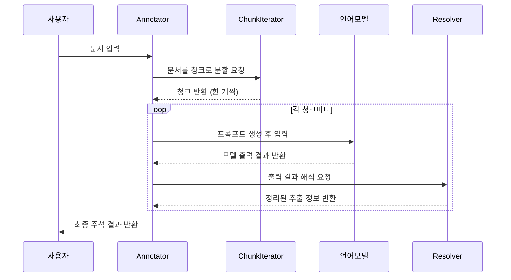

# Chapter 4: 문서 및 청크에 대한 주석 처리 파이프라인 (Annotator)

---

## 1. 이전 장과 이어서

앞서 [문서 토크나이저 및 청크 분할기 (Tokenizer와 ChunkIterator)](03_문서_토크나이저_및_청크_분할기__tokenizer와_chunkiterator__.md) 장에서 긴 텍스트를 토큰 단위로 나누고, 여러 문장 청크로 분할하는 방법을 배웠습니다. 이제 이 청크들을 어떻게 언어 모델에 넘기고, 모델의 출력 결과를 원본 문서에 맞게 정리하는지 알아볼 차례입니다.  
이번 장에서는 이 과정 전체를 총괄하는 핵심 도구인 **문서 및 청크에 대한 주석 처리 파이프라인**, 즉 `Annotator`에 대해 쉽게 설명합니다.

---

## 2. 왜 주석 처리 파이프라인(Annotator)이 필요할까?

예를 들어 여러분이 긴 뉴스 기사에서 사람 이름, 날짜, 장소 같은 정보를 뽑으려고 한다고 가정해봅시다.

- 기사를 작은 청크로 나눠서  
- 각각의 청크를 언어 모델에 보내 질문(prompt)을 만들고  
- 모델이 답변한 결과를 받아서  
- 다시 원래 기사 속 위치에 맞게 정보를 정리해 붙여넣는 작업이 필요합니다.

이 모든 걸 사용자가 직접 관리하기는 매우 복잡하겠죠?  
또, 긴 문서는 한 번에 전부 처리하기 어려우니 여러 번 나누어 처리하고, 결과를 합치는 과정도 있어야 합니다.

그래서 `Annotator`는 다음을 자동으로 해줍니다.

- 문서를 여러 청크로 나누고  
- 청크별로 모델과 상호작용하여 추출 결과 받기  
- 모델 출력 결과를 해석하고, 원본 문서 위치에 정렬하기  
- 여러 차례 추출 작업을 거쳐 정확도를 높이기  
- 모든 결과를 합쳐 최종 주석 결과를 만들기  

즉, 복잡한 **문서 내 정보 추출 작업을 자동으로 오케스트레이션하는 ‘지휘자’** 역할을 한다고 생각하면 쉽습니다.

---

## 3. 주요 개념 쉽게 이해하기

### 3-1. 문서 분할과 청크 (Document, TextChunk)

- 입력된 긴 문서(`Document`)를 내부적으로 여러 작고 다룰 만한 조각(`TextChunk`)으로 나눕니다.  
- 각 청크는 원문에서 어디 위치인지도 같이 기억합니다.  
- `ChunkIterator`가 이 역할을 하지만, `Annotator`는 문서별 청크를 하나씩 순서대로 처리합니다.

### 3-2. 프롬프트 생성 (Prompt Generation)

- 각 청크 텍스트를 언어 모델에게 던질 ‘질문’ 또는 ‘지시문’을 만듭니다.  
- `PromptTemplateStructured` 같은 템플릿을 통해, 기대하는 형식(예: YAML, JSON)과 부가 정보를 넣어 프롬프트를 꾸밉니다.

### 3-3. 모델 추론 (Language Model Inference)

- 만들어진 프롬프트를 언어 모델에 보냅니다.  
- 모델은 답변(추출 결과)을 주면, 여러 후보답안을 점수와 함께 반환하기도 합니다.

### 3-4. 결과 해석 및 정렬 (Resolver + Alignment)

- 모델의 출력은 텍스트 형식이지만, 이를 실제 구조화된 추출 정보(`Extraction`)로 변환합니다.  
- 그리고 원래 청크 위치와 토큰 위치에 맞게 출력 결과를 ‘정렬’하여 원본 문서와 연결합니다.

### 3-5. 여러 번 추출 시도 (Extraction Passes)

- 한 번만 추출하지 않고, 같은 문서에 대해 여러 차례 추출 작업을 수행할 수 있습니다.  
- 각각의 결과를 병합하면서 겹치는 정보는 중복되지 않도록 관리합니다.  
- 이를 통해 누락된 정보도 더 많이 찾게 되어 **정확도와 재현율**을 높입니다.

---

## 4. 어떻게 사용하는가? 간단한 예제

아래 예제는 아주 간단한 형태로 `Annotator`를 만들어서 한 문장을 주석 처리하는 과정을 보여줍니다.  
(실제 사용 시에는 언어 모델과 프롬프트 템플릿이 필요합니다.)

```python
from langextract import data, inference, prompting, annotation, resolver

# 1. (가상) 언어 모델과 프롬프트 템플릿 준비
language_model = inference.MockLanguageModel()  # 실제 모델 교체 필요
prompt_template = prompting.PromptTemplateStructured(template="사람 이름, 날짜 등을 YAML 형식으로 추출하세요.")

# 2. Annotator 생성
annotator = annotation.Annotator(language_model, prompt_template)

# 3. 문서 생성
doc = data.Document(text="홍길동은 2023년 1월 1일에 서울에서 태어났다.")

# 4. 주석 처리 (annotate_documents는 제너레이터 형태)
for annotated_doc in annotator.annotate_documents([doc]):
    print("문서 ID:", annotated_doc.document_id)
    for ext in annotated_doc.extractions:
        print(f"종류: {ext.extraction_class}, 텍스트: {ext.extraction_text}")
```

- `Document` 객체에 긴 텍스트를 넣습니다.  
- `Annotator`가 문서를 청크로 나누고, 각 청크를 모델에 넘겨 답변을 받습니다.  
- 모델의 답변은 `Extraction` 객체로 바뀌어, 결과로 리턴됩니다.

예측 결과는 다음처럼 출력될 수 있습니다.

```
문서 ID: 자동생성된ID1234
종류: 인물, 텍스트: 홍길동
종류: 날짜, 텍스트: 2023년 1월 1일
종류: 장소, 텍스트: 서울
```

---

## 5. 내부 처리 과정 이해하기

`Annotator`가 내부에서 실제 어떻게 처리하는지, 큰 흐름부터 살펴볼게요.



1. **문서를 넣으면** 내부에서 문서를 청크 단위로 나눕니다.  
2. 청크마다 **프롬프트를 만들어 언어 모델에 넘깁니다.**  
3. 모델이 답변을 주면, **Resolver가 이를 구조화된 정보로 해석합니다.**  
4. 각 청크에서 나온 추출 결과를 모아 문서 단위로 합칩니다.  
5. 경우에 따라 여러 차례 추출(pass)를 거치면서 더 완성도 높은 결과를 만듭니다.

---

## 6. 내부 코드 핵심 부분 살펴보기

### 6-1. `_document_chunk_iterator`: 문서→청크 변환기

```python
def _document_chunk_iterator(documents, max_char_buffer):
    visited_ids = set()
    for document in documents:
        if document.document_id in visited_ids:
            raise DocumentRepeatError("중복 문서 ID 오류")
        chunk_iter = chunking.ChunkIterator(
            text=document.tokenized_text,
            max_char_buffer=max_char_buffer,
            document=document,
        )
        visited_ids.add(document.document_id)
        yield from chunk_iter
```

- 문서 하나마다 `ChunkIterator`가 여러 `TextChunk`를 만듭니다.  
- 중복된 문서 ID는 오류 처리합니다.

### 6-2. `Annotator.annotate_documents`: 전체 주석 처리 흐름

```python
def annotate_documents(self, documents, resolver, max_char_buffer, batch_length, debug, extraction_passes, **kwargs):
    if extraction_passes == 1:
        yield from self._annotate_documents_single_pass(documents, resolver, max_char_buffer, batch_length, debug, **kwargs)
    else:
        yield from self._annotate_documents_sequential_passes(documents, resolver, max_char_buffer, batch_length, debug, extraction_passes, **kwargs)
```

- 기본적으로 한 번 추출하지만, `extraction_passes` > 1일 때는 여러 번 추출하여 결과를 병합합니다.

### 6-3. `_annotate_documents_single_pass`: 단일 추출 과정

- 문서를 청크별로 나누고, 한 배치(batch)씩 모델에 묶어 보냅니다.  
- 모델 결과는 `Resolver`가 해석 후, 청크 위치 정보를 이용해 원본 문서에 맞게 정렬합니다.  
- 청크별 추출 결과를 모아 문서 단위로 묶어 반환합니다.

```python
for text_chunk, scored_outputs in zip(batch, model_outputs):
    # 모델 출력 해석
    annotated_chunk_extractions = resolver.resolve(scored_outputs[0].output)
    # 청크 위치에 맞게 정렬
    aligned_extractions = resolver.align(annotated_chunk_extractions, chunk_text, token_offset, char_offset)
    all_extractions.extend(aligned_extractions)
```

### 6-4. `_annotate_documents_sequential_passes`: 여러 번 추출하여 병합

```python
for pass_num in range(extraction_passes):
    for annotated_doc in self._annotate_documents_single_pass(document_list, resolver, ...):
        # pass 결과 저장
# 중복 추출 결과를 _merge_non_overlapping_extractions 함수로 겹치는 부분 없이 합침
```

- 여러 번 추출 결과를 받아 겹치는 위치는 처음 추출이 우선하도록 병합합니다.

---

## 7. 비유로 더 쉽게 이해하기

- **책(문서)를 여러 페이지(청크)로 나누어, 각 페이지마다 질문지를 만들어 '내용 요약'을 요청한다고 생각해봅시다.**  
- 요약 결과는 다시 페이지 위치에 맞게 정확하게 붙입니다.  
- 때로는 같은 페이지를 두 번 보고, 더 놓친 부분이 없는지 확인하는 것과 같습니다.  
- 이렇게 하면 전체 책 내용을 놓치지 않고, 빠짐없이 중요한 정보를 체계적으로 모을 수 있습니다.

---

## 8. 이번 장 요약

이번 장에서는 `Annotator`라는 문서 및 청크 기반의 주석 처리 파이프라인에 대해 배웠습니다.  
주된 핵심은

- 문서를 여러 청크로 나누고  
- 청크별로 언어 모델에 명령을 내려 답을 얻으며  
- 결과를 해석하고 원본에 맞게 정렬하는 일련의 과정  
- 더 높은 정확도를 위한 여러 차례 추출 시도와 결과 병합  

이 모든 과정을 `Annotator`가 자동으로 관리한다는 점을 알게 되었습니다.

---

## 9. 다음 장 예고

다음 장에서는 이번에 `Annotator`와 함께 사용한 프롬프트 템플릿 도구들, 즉 **프롬프트 빌더 및 템플릿 생성기 (PromptTemplateStructured & QAPromptGenerator)**에 대해 배웁니다.  
효과적인 프롬프트 만들기 비결과 템플릿 활용법에 대해 차근차근 알아보겠습니다.

[다음 장 보기: 프롬프트 빌더 및 템플릿 생성기 (PromptTemplateStructured & QAPromptGenerator)](05_프롬프트_빌더_및_템플릿_생성기__prompttemplatestructured___qapromptgenerator__.md)  

---

### 감사합니다! 다음 장에서 또 만나요 :)

---
