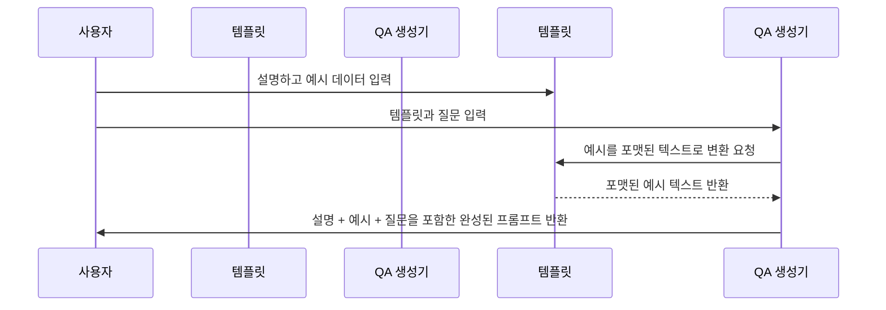

# Chapter 5: 프롬프트 빌더 및 템플릿 생성기 (PromptTemplateStructured & QAPromptGenerator)

---

## 1. 이전 장과 이어서

지난 장에서는 [문서 및 청크에 대한 주석 처리 파이프라인 (Annotator)](04_문서_및_청크에_대한_주석_처리_파이프라인__annotator__.md)에서 긴 문서를 작은 청크로 나누고, 각 청크에 대해 언어 모델을 호출해서 정보를 추출하고, 결과를 정리하는 과정을 배웠습니다.

이번 장에서는 바로 그 언어 모델에 넘기는 **프롬프트(질문)**를 만드는 도구인 **프롬프트 빌더 및 템플릿 생성기**, 즉 `PromptTemplateStructured`와 `QAPromptGenerator`에 대해 아주 쉽게 알아보겠습니다.

---

## 2. 왜 프롬프트 빌더와 템플릿 생성기가 필요할까요?

언어 모델에게 "이 텍스트에서 사람 이름이 뭐야?" 라고 물어볼 때, 단순히 질문만 던지면 원하는 결과를 얻기 어렵습니다.

- 모델에게 어떤 정보를 기대하는지 명확히 알려야 하고,  
- 어떻게 답변하면 좋은지 예시를 보여줘야 하며,  
- 여러 예시를 구조적인 포맷으로 전달해서 모델이 혼동하지 않게 해야 합니다.

이 일을 우리가 일일이 문자를 조합해서 하려면 매우 번거롭고 오류도 많죠.

그래서 **프롬프트 빌더와 템플릿 생성기**는

> "모델에게 무엇을 물어보고, 어떻게 답변을 기대하는지"를  
> 읽기 쉽고, 알기 쉬운 형식(예: YAML, JSON)으로 깔끔하게 만들어 주는 '대화 설계자' 역할을 합니다.

프롬프트를 체계적으로 설계하면, 모델은 더 정확하고 일관된 답변을 할 수 있습니다.

---

## 3. 핵심 개념 소개

### 3-1. `PromptTemplateStructured`

- **무엇인가요?**  
  프롬프트를 만들기 위한 '설명서' 역할을 하는 데이터 구조입니다.  
  보통 다음 내용을 가지고 있습니다:

  - **description**: 모델에게 지시하는 설명 또는 가이드  
  - **examples**: 어떻게 질문하고 답하는지 보여주는 예시들 (입력 텍스트와 기대하는 답변 형태)

- **왜 필요할까요?**  
  모델에게 그냥 질문만 던지는 게 아니라,  
  질문과 답의 좋은 사례를 여러 개 보여주면서 원하는 답변 형식을 명확히 알려주려고 합니다.

- **예시 그림**  
  ```
  description: "아래 질문에 답변할 때 YAML 형식으로 답하라."
  examples:
    - text: "이름은 홍길동이고, 날짜는 2023년 1월 1일입니다."
      extractions:
        - 종류: 인물
          텍스트: 홍길동
        - 종류: 날짜
          텍스트: 2023년 1월 1일
  ```

### 3-2. `QAPromptGenerator`

- **무엇인가요?**  
  `PromptTemplateStructured`에 담긴 설명과 예시들을 바탕으로,  
  실제 모델에 전달할 **완성된 프롬프트(질문 포함)**를 만들어 주는 도구입니다.

- **특징**  
  - 질문 앞에 접두사(`Q: `), 답변 앞에 접두사(`A: `)를 붙입니다.  
  - 답변 영역을 YAML 또는 JSON 코드 블록(````yaml```, ````json```)으로 감싸서 모델이 구조화된 답변을 하도록 유도합니다.  
  - 여러 예시를 하나의 프롬프트로 묶어줍니다.

- **어떻게 사용하나요?**  
  질문을 입력하면, 예전의 설명과 예시들이 포함된 멋진 프롬프트를 만들어 줍니다.

---

## 4. 프롬프트 빌더와 템플릿 생성기를 사용해보기 (실제 예제)

아래는 아주 간단한 예제입니다.  
"2023년 1월 1일에 태어난 홍길동"이라는 텍스트에서 인물과 날짜 정보를 YAML 형식으로 추출하려고 합니다.

### 4-1. 1) `PromptTemplateStructured` 만들기

```python
from langextract.data import ExampleData, Extraction
from langextract.prompting import PromptTemplateStructured

# 예시 추출 정보 생성
example_extraction1 = Extraction(extraction_class="인물", extraction_text="홍길동")
example_extraction2 = Extraction(extraction_class="날짜", extraction_text="2023년 1월 1일")

# 예시 데이터 하나 생성
example = ExampleData(
    text="홍길동은 2023년 1월 1일에 태어났다.",
    extractions=[example_extraction1, example_extraction2]
)

# 프롬프트 템플릿 생성
template = PromptTemplateStructured(
    description="다음 텍스트에서 '인물'과 '날짜'를 YAML 형식으로 추출하시오.",
    examples=[example]
)
```

- `description`: 모델에게 무엇을 할지 설명  
- `examples`: 어떻게 질문과 답변이 구성되는지 보여주는 실제 예제

### 4-2. 2) `QAPromptGenerator`로 프롬프트 만들기

```python
from langextract.prompting import QAPromptGenerator
from langextract.data import FormatType

# QAPromptGenerator 생성 (YAML 포맷 지정)
qa_generator = QAPromptGenerator(template=template, format_type=FormatType.YAML)

# 실제 질문 생성 (빈 문자열로 질문 설정 가능)
prompt_text = qa_generator.render(
    question="서울에서 태어난 사람 이름은 무엇인가요?"
)

print(prompt_text)
```

- `render`가 프롬프트 문자를 생성합니다.  
- 출력 예시는 다음처럼 나오는데, 실제 모델에 보낼 수 있는 완성된 질문 + 예시 + 답변 코드 블록 포함 프롬프트가 됩니다.

**예상 출력 (일부):**

```
다음 텍스트에서 '인물'과 '날짜'를 YAML 형식으로 추출하시오.

Examples
Q: 홍길동은 2023년 1월 1일에 태어났다.
A: ```yaml
extractions:
- 인물: 홍길동
  인물_attributes: {}
- 날짜: 2023년 1월 1일
  날짜_attributes: {}
```

Q: 서울에서 태어난 사람 이름은 무엇인가요?
A: 
```

---

## 5. 내부 동작 이해하기: 프롬프트 생성 과정

프롬프트 빌더가 동작하는 과정을 간단히 그림으로 설명합니다.



**설명:**  
1. 사용자(개발자)가 `PromptTemplateStructured`에 모델 지침과 예시를 등록합니다.  
2. `QAPromptGenerator`는 이 템플릿을 받아, 각 예시를 YAML이나 JSON 형식의 질문과 답변으로 바꿉니다.  
3. 마지막으로 전달할 질문을 넣어, 완성된 프롬프트 텍스트를 만듭니다.  
4. 이 텍스트를 언어 모델에 넘겨 사용할 수 있습니다.

---

## 6. 내부 코드 간단히 살펴보기

### 6-1. `PromptTemplateStructured` 클래스 (langextract/prompting.py)

```python
@dataclasses.dataclass
class PromptTemplateStructured:
    description: str  # 모델에게 줄 구체적 설명
    examples: list[data.ExampleData] = dataclasses.field(default_factory=list)  # 예시 목록
```

- `description`: 모델에 지시사항 문장  
- `examples`: 여러 예시를 담은 리스트 (각 예시에는 질문 텍스트와 기대 출력 포함)

### 6-2. `QAPromptGenerator` 클래스 일부

```python
@dataclasses.dataclass
class QAPromptGenerator:
    template: PromptTemplateStructured
    format_type: data.FormatType = data.FormatType.YAML

    def format_example_as_text(self, example: data.ExampleData) -> str:
        # 예시 질문과, YAML/JSON 형식으로 된 답변을 문자열로 변환
        question = example.text
        # 추출 결과를 형식에 맞춰 직렬화 (YAML, JSON)
        # 예: f"Q: {question}\nA: ```yaml\n{yaml내용}\n```"
        ...
        return formatted_example_text

    def render(self, question: str, additional_context: str | None = None) -> str:
        # 전체 프롬프트 문장 완성
        parts = [self.template.description + "\n"]
        if self.template.examples:
            parts.append("Examples")
            for ex in self.template.examples:
                parts.append(self.format_example_as_text(ex))
        parts.append(f"Q: {question}")
        parts.append("A: ")
        return "\n".join(parts)
```

- `format_example_as_text`가 각 예시를 읽기 좋은 질문+답변 형식으로 만들어 줍니다.  
- `render`가 설명, 예시, 그리고 실제 질문을 조합해 프롬프트 문장을 완성합니다.

---

## 7. 비유로 쉽게 이해하기

- 프롬프트 빌더는 '수업 교재를 만드는 선생님'과 같습니다.  
- 학생(모델)에게 무엇을 배우고 어떤 식으로 답해야 하는지 설명서와 예시 문제를 제공하죠.  
- `PromptTemplateStructured`는 이 교재의 목차와 내용이고,  
- `QAPromptGenerator`는 그 교재를 실제 수업 당일에 학생에게 보여줄 수업자료(프롬프트)를 만들어 주는 조교입니다.

이렇게 하면 모델이 원하는 답을 더 잘 찾고, 여러분도 쉽게 프롬프트 설계를 할 수 있습니다.

---

## 8. 이번 장 요약 및 다음 장 예고

이번 장에서는

- 모델에게 질문과 예시를 체계적으로 알려주는 **프롬프트 템플릿(`PromptTemplateStructured`)**  
- 템플릿에서 실제 보낼 프롬프트를 만드는 **Q&A 프롬프트 생성기(`QAPromptGenerator`)**  

에 대해 배웠습니다.  
프롬프트를 깔끔한 YAML/JSON 형식으로 만들고, 여러 예시를 함께 보여줌으로써  
언어 모델이 정확한 형식과 내용을 이해하고 답변할 수 있도록 도와주는 역할을 합니다.

다음 장에서는 이렇게 만들어진 프롬프트를 실제 구동할 수 있도록 **모델 공급자 등록 및 인스턴스 생성 시스템 (Provider Registry & Factory)**에 대해 배워봅니다.  
[다음 장 보기: 모델 공급자 등록 및 인스턴스 생성 시스템 (Provider Registry & Factory)](06_모델_공급자_등록_및_인스턴스_생성_시스템__provider_registry___factory__.md)  

---

### 감사합니다! 다음 장에서 또 만나요 :)

---
