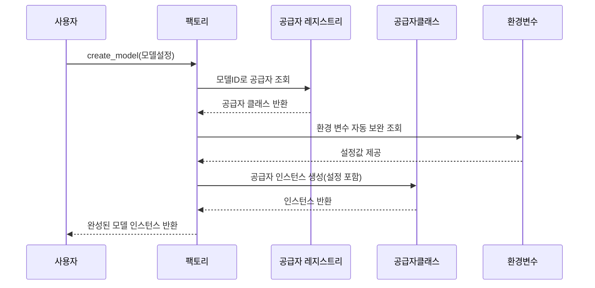

# Chapter 6: 모델 공급자 등록 및 인스턴스 생성 시스템 (Provider Registry & Factory)

---

## 1. 이전 장과 이어서

지난 장에서는 [프롬프트 빌더 및 템플릿 생성기 (PromptTemplateStructured & QAPromptGenerator)](05_프롬프트_빌더_및_템플릿_생성기__prompttemplatestructured___qapromptgenerator__.md)에서 언어 모델에게 질문하는 **프롬프트를 만드는 방법**을 배웠습니다.  
이번 장에서는 이렇게 만들어진 프롬프트를 실제로 해석해 줄 **모델 인스턴스**를 어떻게 생성하고 관리하는지 알아보려 합니다.  

즉, 다양한 언어 모델 공급자를 등록하고, 설정에 맞게 올바른 모델 객체를 만들어 내는 **“모델 공급자 등록 및 인스턴스 생성 시스템”**에 대해 쉽고 친절하게 설명합니다.

---

## 2. 왜 모델 공급자 등록 및 인스턴스 생성 시스템이 필요할까?

예를 들어 여러분이 `gemini-2.5-flash`, `openai-gpt-4o`, `ollama-local` 같은 여러 회사의 여러 모델을 사용한다고 가정해 보세요.  
- 모델마다 호출 방법이 다르고  
- 인증 키, API 주소, 옵션 등 설정법도 모두 다르죠.  

일일이 모델 종류마다 별도의 코드를 짜고 관리하는 것은 복잡하고 비효율적입니다.  
그래서 우리는 **모델 공급자를 등록하고, 모델 아이디(model_id)나 이름(provider)을 가지고 필요한 모델을 자동으로 찾아 생성해주는 시스템이 필요합니다.**

이 시스템이 하는 역할은 크게 두 가지입니다.

1. **공급자 등록(Provider Registry)**  
   사용 가능한 여러 모델 공급자들은 여기에 등록되어 있고,  
   모델 아이디를 입력하면 어떤 공급자가 그 모델을 지원하는지 알려줍니다.

2. **인스턴스 생성 팩토리(Factory)**  
   모델 ID, 공급자 이름, 옵션 등을 바탕으로  
   해당 공급자를 찾아서 **맞춤형 모델 인스턴스**를 생성합니다.

덕분에 개발자는 모델만 바꾸고, 내부 구현이나 인증 과정 등 복잡한 부분은 신경 쓸 필요 없이 손쉽게 다양한 언어 모델을 사용할 수 있습니다.

---

## 3. 주요 개념 하나씩 살펴보기

### 3-1. 모델 공급자(Provider)란?

- **공급자**는 특정 회사나 API가 제공하는 언어 모델을 추상화한 클래스입니다.  
- 예: `GeminiLanguageModel`, `OpenAILanguageModel`, `OllamaLanguageModel` 등이 있습니다.  
- 각각은 특정 모델을 호출하는 방법, 인증 처리, 출력 다루는 법을 담고 있습니다.

---

### 3-2. 공급자 등록(Provider Registry)

- 공급자를 사용하기 전에 ‘등록’해야 합니다.  
- 등록은 모델 ID 패턴(예: `"gemini-.*"`, `"openai-gpt.*"`)을 등록하여  
  어떤 모델 ID가 들어오면 해당 공급자가 적합한지 확인하게 합니다.  
- 예를 들어 `"gemini-2.5-flash"`라는 모델 아이디를 넣으면, 레지스트리는 `GeminiLanguageModel`을 찾아줍니다.

---

### 3-3. 모델 설정(ModelConfig)

- 모델 생성 요청 시 설정 정보를 간단히 묶어 관리하는 객체입니다.  
- 주요 속성은  
  - `model_id`: 예) `"gemini-2.5-flash"`  
  - `provider`: 공급자를 직접 명시할 수도 있음 (예) `"gemini"`)  
  - `provider_kwargs`: 공급자에 넘길 추가 설정 옵션(예, API 키, URL 등)

---

### 3-4. 인스턴스 생성 팩토리(Factory)

- 설정과 공급자 등록 정보를 바탕으로  
- 적절한 공급자 클래스를 찾아서  
- 내부 규칙과 환경변수 등을 고려해 설정을 보완한 뒤  
- 실질적인 모델 객체(인스턴스)를 생성해 줍니다.

---

### 3-5. 환경 변수 기본값 처리

- API 키, 기본 URL 등은 직접 입력 안 해도  
- 시스템 환경변수 내에서 자동으로 찾아 설정해 줍니다.  
- 예를 들어 모델 ID에 “gemini”가 포함되면 `"GEMINI_API_KEY"` 같은 환경변수를 자동으로 찾아 사용합니다.

---

## 4. 모델 공급자 등록 및 생성 시스템 사용법

### 4-1. 간단한 모델 생성 흐름

```python
from langextract.factory import create_model

# model_id만 지정해서 모델 생성
model = create_model(
    model_id="gemini-2.5-flash"
)

print(type(model))  # GeminiLanguageModel 인스턴스가 반환됨
```

- `create_model` 함수에 모델 ID를 넘기면  
- 내부 등록된 공급자를 찾아 관련 환경 변수도 자동으로 적용해  
- 해당 모델 인스턴스를 만들어 줍니다.

---

### 4-2. 공급자 직접 지정하기

```python
model = create_model(
    model_id="unknown-model",
    provider="gemini",  # 공급자를 직접 명시해 혼동 방지
    provider_kwargs={"api_key": "내_키_여기"}
)
```

- 기본 검색이 어려울 때 공급자 이름을 명시하면 오류 없이 처리됩니다.  
- 공급자 옵션을 사전에 조절하고 싶을 때 `provider_kwargs`를 사용할 수 있습니다.

---

### 4-3. 환경 변수 예시

- 운영체제 환경 변수에 아래처럼 설정하면,  
- 코드에서는 API 키를 직접 안 줘도 자동으로 읽어 와 사용합니다.

```bash
export GEMINI_API_KEY="내_진짜_키_값"
export OLLAMA_BASE_URL="http://localhost:11434"
```

---

### 4-4. 에러 상황

```python
model = create_model(model_id=None)  # 오류 발생: model_id 혹은 provider가 필요함
```

- 설정이 모호하면 `ValueError`가 납니다.  
- 잘못된 옵션이나 지원하지 않는 모델 ID도 적절한 예외를 던집니다.

---

## 5. 내부 동작 흐름 이해하기

모델을 생성할 때 시스템 내부에서 무슨 일이 일어나는지 간단한 다이어그램으로 살펴봅니다.



- 사용자가 모델 생성 요청을 합니다.  
- 팩토리는 등록된 공급자 중 모델 ID에 맞는 공급자를 찾습니다.  
- 설정을 환경변수로 보완하고  
- 공급자 클래스를 인스턴스화 합니다.

---

## 6. 내부 코드 핵심 개념 살펴보기

### 6-1. `ModelConfig` 데이터 클래스 (설정 정리)

```python
@dataclasses.dataclass(slots=True, frozen=True)
class ModelConfig:
  model_id: str | None = None
  provider: str | None = None
  provider_kwargs: dict[str, typing.Any] = dataclasses.field(default_factory=dict)
```

- 모델 생성에 필요한 정보를 묶은 객체입니다.  
- 설정을 깔끔하게 넘길 수 있고 변경을 막습니다.

### 6-2. 키워드 인자 환경변수 기본값 보충 함수

```python
def _kwargs_with_environment_defaults(model_id, kwargs):
  resolved = dict(kwargs)
  if "api_key" not in resolved:
    if "gemini" in model_id.lower():
      resolved["api_key"] = os.getenv("GEMINI_API_KEY") or os.getenv("LANGEXTRACT_API_KEY")
    elif "gpt" in model_id.lower():
      resolved["api_key"] = os.getenv("OPENAI_API_KEY") or os.getenv("LANGEXTRACT_API_KEY")
  if "ollama" in model_id.lower() and "base_url" not in resolved:
    resolved["base_url"] = os.getenv("OLLAMA_BASE_URL", "http://localhost:11434")
  return resolved
```

- 입력된 옵션에 없으면 환경 변수를 찾아 대체합니다.  
- `model_id` 문자열 패턴에 따라 알맞은 환경 변수를 선택합니다.

### 6-3. `create_model` 함수 (모델 인스턴스 생성 핵심)

```python
def create_model(config: ModelConfig) -> BaseLanguageModel:
  if not config.model_id and not config.provider:
    raise ValueError("model_id 또는 provider를 지정해야 합니다.")

  # 공급자 클래스 탐색
  if config.provider:
    provider_class = registry.resolve_provider(config.provider)
  else:
    providers.load_builtins_once()
    providers.load_plugins_once()
    provider_class = registry.resolve(config.model_id)

  # 환경 변수 보완 옵션
  kwargs = _kwargs_with_environment_defaults(config.model_id or "", config.provider_kwargs)
  if config.model_id:
    kwargs["model_id"] = config.model_id

  # 인스턴스 생성 및 반환
  model = provider_class(**kwargs)
  return model
```

- 모델이나 공급자명이 없으면 오류 발생  
- 공급자 찾고, 설정 보완 후 인스턴스 생성

---

## 7. 비유로 쉽게 이해하기

- **공급자 등록(Registry)**는 마치 도서관의 책 찾기 시스템 같아요.  
  - 책 이름(모델 ID)을 입력하면 어디 선반(공급자)이 해당 책을 갖고 있는지 알려줍니다.

- **팩토리(Factory)**는 도서관 사서입니다.  
  - 사서에게 책 이름과 특별한 요청(설정)을 주면,  
  - 적절한 책을 꺼내어(모델 인스턴스 생성) 여러분에게 줍니다.

- 사서는 또 필요한 정보(키, URL)를 환경에서 찾아서 학교 사무실에 전화해서 얻은 뒤에 책을 준비합니다.  

이렇게 하면 여러분은 복잡한 서가를 일일이 다 돌아다니지 않아도, 원하는 책(모델)을 쉽게 얻을 수 있죠!

---

## 8. 이번 장 정리 및 다음 장 연결

이번 장에서는 `langextract`에서

- 다양한 언어 모델 공급자를 등록하는 **공급자 레지스트리**  
- 설정 기반으로 적절한 모델 인스턴스를 생성하는 **팩토리 함수**

에 대해 집중적으로 살펴보았습니다.

이로써 여러분은

- 모델 ID만으로 적절한 모델 클래스를 찾아내고  
- 환경변수 기반 인증 정보까지 자동으로 적용해  
- 손쉽게 원하는 모델 객체를 생성할 수 있는 기술을 익혔습니다.  

다음 장에서는 이런 공급자를 실제로 구현한 예시인 **Gemini 및 Ollama 공급자 구현**을 상세하게 살펴봅니다.  
더불어 직접 모델 API를 어떻게 호출하는지 확인할 수 있을 거예요.  
[다음 장 보기: 공급자 예시: Gemini 및 Ollama 공급자 구현](07_공급자_예시__gemini_및_ollama_공급자_구현_.md)

---

### 감사합니다! 다음 장에서 또 만나요 :)

---
