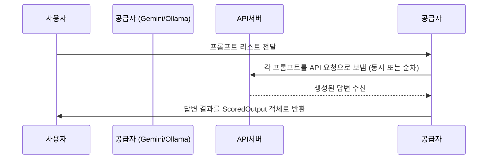

# Chapter 7: 공급자 예시: Gemini 및 Ollama 공급자 구현

---

## 1. 이전 장과 이어서

지난 장에서는 [모델 공급자 등록 및 인스턴스 생성 시스템 (Provider Registry & Factory)](06_모델_공급자_등록_및_인스턴스_생성_시스템__provider_registry___factory__.md)에서 다양한 언어 모델 공급자를 등록하고, 설정에 맞게 모델 인스턴스를 만들어내는 방법을 배웠습니다.

이번 장에서는 실제로 두 가지 대표적인 모델 공급자 **Gemini**와 **Ollama**를 어떻게 구현하는지 살펴봅니다.  
직접 인증 키를 관리하고, API와 통신하며, 응답을 다루는 구체적인 방법을 이해하면, 새로운 공급자를 만들 때 큰 도움이 됩니다.  

---

## 2. 공급자 구현이 왜 필요할까요?

언어 모델을 쓰려면, 텍스트를 던지고 답변을 받는 과정이 필수입니다.  
이 과정에서 각 모델마다 API 주소, 인증 키, 요청 형식, 응답 형식, 병렬 호출 방법 등이 다릅니다.  

예를 들어,

- Google의 Gemini 모델은 구글이 제공하는 정교한 API와 JSON 스키마 제약을 활용합니다.  
- Ollama 모델은 로컬에서 실행되며 HTTP 서버로 명령을 보내는 오픈소스 기반입니다.  

이 두 모델은 호출 방식이 완전히 달라서, 각각에 맞는 별도의 공급자 클래스를 만들어야 합니다.  

공급자 클래스는 아래 작업을 담당합니다.  

- API 키, URL 등 인증과 네트워크 설정  
- 요청 메시지 생성 및 제한 조건 처리  
- 응답 결과 수신 및 오류 처리  
- 필요에 따라 출력 결과에 스키마 제약을 적용  
- 병렬 요청 시도 및 결과 결합  

---

## 3. Gemini 공급자 구현 이해하기

### 3-1. Gemini는 무엇인가?

- 구글에서 개발한 강력한 AI 언어 모델입니다.  
- JSON 스키마 기반의 구조화된 출력이 가능해, 원하는 데이터 구조를 강제할 수 있습니다.  
- Gemini 공급자는 이 API를 이용해 텍스트 생성과 구조화된 출력 결과를 주고받습니다.

### 3-2. Gemini 공급자 주요 특성

- `model_id`, `api_key`로 초기화합니다.  
- 내부에서 `google.genai` 클라이언트를 사용해 API 호출을 합니다.  
- 병렬 호출을 위해 `ThreadPoolExecutor`를 쓸 수 있어, 대용량 요청 시 속도가 빠릅니다.  
- 출력 형식을 JSON으로 고정하거나, 필요시 YAML도 지원하나 구조화된 출력은 JSON 권장입니다.  
- API 파라미터는 허용된 목록(`_API_CONFIG_KEYS`)만 전달해 안전성을 유지합니다.

### 3-3. Gemini 공급자 간단 사용 예

```python
from langextract.providers.gemini import GeminiLanguageModel

model = GeminiLanguageModel(api_key="내_구글_API_키")

prompts = [
    "홍길동이라는 인물과 2023년 1월 1일이라는 날짜를 찾아줘.",
    "서울과 관련된 장소 정보를 알려줘."
]

for output_list in model.infer(prompts):
    print(output_list[0].output)
```

- `api_key`를 제공해 인증합니다.  
- 여러 프롬프트를 동시에 `infer()`에 넘기면 병렬로 처리합니다.  
- 결과는 `ScoredOutput` 객체 리스트로 나오며, `output` 속성에 완성된 답변이 포함됩니다.  

---

## 4. Ollama 공급자 구현 이해하기

### 4-1. Ollama는 무엇인가?

- 로컬에 설치해서 쓰는 오픈소스 LLM 서버입니다.  
- HTTP REST API를 통해 모델에 질문을 보내고 응답을 받습니다.  
- API 키 없이도 로컬에서 바로 쓸 수 있어, 인증 설정이 간단합니다.

### 4-2. Ollama 공급자 주요 특성

- `model_id`(예: `"gemma2:2b"`), `model_url`(기본: `http://localhost:11434`)을 받아 초기화합니다.  
- `requests` 라이브러리로 서버에 POST 요청을 합니다.  
- 출력은 JSON 또는 YAML 포맷을 지원합니다.  
- 타임아웃, 온도(temperature), 최대 출력 토큰 수 등 다양한 옵션을 유연하게 제어할 수 있습니다.  
- 요청 시 발생하는 HTTP 오류나 서버 오류를 예외로 처리합니다.

### 4-3. Ollama 공급자 간단 사용 예

```python
from langextract.providers.ollama import OllamaLanguageModel

model = OllamaLanguageModel(model_id="gemma2:2b")

prompts = ["아이작 아시모프에 관한 짧은 소개를 작성해줘."]

for output_list in model.infer(prompts):
    print(output_list[0].output)
```

- 서버가 자동으로 실행되고 있어야 요청이 처리됩니다.  
- `infer` 메서드는 프롬프트 리스트를 받아 하나씩 처리하고 결과를 순차적으로 반환합니다.

---

## 5. 공급자 구현 내부 흐름 살펴보기

두 공급자 모두 대체로 다음과 같은 내부 과정을 거칩니다.



- 여러 프롬프트를 한꺼번에 넘길 경우, Gemini는 병렬 호출을 통해 빠르게 처리합니다.   
- Ollama는 상대적으로 순차 호출이 기본입니다.  
- 응답을 받으면 `ScoredOutput` 객체를 만들어 점수(기본 1.0)와 결과 텍스트를 함께 제공합니다.  
- 에러 발생 시 명확한 예외를 던져서 호출 측에서 처리 가능하게 합니다.

---

## 6. 공급자 구현 핵심 코드 이해하기

### 6-1. Gemini 공급자 초기화 부분 (간략화)

```python
class GeminiLanguageModel(inference.BaseLanguageModel):
    def __init__(self, model_id='gemini-2.5-flash', api_key=None, **kwargs):
        if api_key is None:
            raise ValueError("API 키가 필요합니다.")
        from google import genai
        self._client = genai.Client(api_key=api_key)
        self.model_id = model_id
        self._extra_kwargs = {k: v for k, v in kwargs.items() if k in _API_CONFIG_KEYS}
```

- `genai.Client`를 생성해 API 호출에 사용할 준비를 합니다.  
- 인증 키가 꼭 필요하며 없으면 오류 발생합니다.

### 6-2. Gemini API 호출 처리 (단일 프롬프트)

```python
def _process_single_prompt(self, prompt, config):
    # config에 추가 옵션 병합
    for k, v in self._extra_kwargs.items():
        if k not in config and v is not None:
            config[k] = v

    # 구조화 출력 설정
    if self.gemini_schema:
        config['response_mime_type'] = 'application/json'
        config['response_schema'] = self.gemini_schema.schema_dict

    response = self._client.models.generate_content(
        model=self.model_id,
        contents=prompt,
        config=config
    )
    return inference.ScoredOutput(score=1.0, output=response.text)
```

- API 옵션을 적합하게 세팅한 뒤 `generate_content` 호출.  
- 구조화된 출력 스키마가 있으면 JSON 형식 사용 강제.  
- 예외 시 명확한 예외 처리 발생.

### 6-3. Ollama API 호출 처리 (단일 프롬프트)

```python
def _ollama_query(self, prompt, model=None, model_url=None, **kwargs):
    url = (model_url or self._model_url) + '/api/generate'
    payload = {
        'model': model or self._model,
        'prompt': prompt,
        'format': 'json' if self.format_type == data.FormatType.JSON else 'yaml',
        'options': kwargs,
    }
    response = self._requests.post(url, json=payload, timeout=kwargs.get('timeout', 120))
    if response.status_code != 200:
        raise RuntimeError(f'Ollama 오류: {response.status_code}')
    return response.json()
```

- HTTP POST로 프롬프트 전송, JSON 또는 YAML 포맷 지정.  
- 200번 응답 아니면 오류 발생.  
- 반환된 JSON 응답에서 생성된 텍스트를 추출해 리턴.

---

## 7. 비유로 이해하기

- Gemini 공급자는 **최첨단 스마트 콜센터 직원** 같아요.  
  - 각 콜(프롬프트)에 대해 신속히 다중 팀들(병렬 작업자)에게 분배해 빠르고 정확한 답변을 받습니다.  
  - 고객이 요구하는 ‘답변 형식’을 철저하게 준수하게 해 줍니다.

- Ollama 공급자는 **내 손 안에 가벼운 조언자**입니다.  
  - 내 컴퓨터에 항상 붙어있고, 내가 질문하면 천천히 챙겨 답해 줍니다.  
  - 인증 절차가 없으니 바로 손쉽게 쓸 수 있어 집콕 연구용에 알맞습니다.

---

## 8. 이번 장 요약 및 다음 장 예고

이번 장에서는 `langextract` 프로젝트에서 중요한

- Gemini 공급자: 구글 API와 JSON 스키마 기반 구조화 출력 처리  
- Ollama 공급자: 로컬 서버와 간단 HTTP 요청 처리  

두 공급자의 실제 구현 방법을 간단히 살펴봤습니다.  
공급자들은 **BaseLanguageModel**을 상속받아 API 키 관리, 요청 생성, 응답 처리, 병렬 호출 등을 담당하고, 필요에 따라 스키마 제약 조건도 적용합니다.  

이제 여러분은 각각의 공급자가 어떤 역할을 하며, 어떻게 내부 동작하는지 이해하게 되었습니다.  
다음 장에서는 **구조화된 출력 제약조건 및 스키마 추상화 (BaseSchema & GeminiSchema)**에 대해 배워서, 실제 스키마를 어떻게 설계하고 적용하는지 더 깊게 알아봅니다.

[다음 장 보기: 구조화된 출력 제약조건 및 스키마 추상 (BaseSchema & GeminiSchema)](08_구조화된_출력_제약조건_및_스키마_추상__baseschema___geminischema__.md)

---

### 감사합니다! 다음 장에서 또 만나요 :)

---
