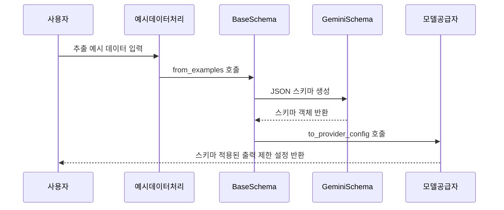

# Chapter 8: 구조화된 출력 제약조건 및 스키마 추상 (BaseSchema & GeminiSchema)

---

## 1. 이전 장과 이어서

지난 장에서는 [공급자 예시: Gemini 및 Ollama 공급자 구현](07_공급자_예시__gemini_및_ollama_공급자_구현_.md)에서 실제 모델 공급자들이 어떻게 API와 통신하고, 구조화된 출력을 처리하는지 살펴보았습니다.  
이번 장에서는 그런 공급자들이 사용할 수 있는 **구조화된 출력 제약조건과 스키마 추상 (BaseSchema & GeminiSchema)**에 대해 배워보겠습니다.  

---

## 2. 왜 구조화된 출력 제약조건과 스키마가 필요할까?

언어 모델에게서 JSON, YAML 같은 **구조화된 데이터**를 안정적으로 뽑아내려면, 단순히 "이렇게 써주세요"라고 말하는 것만으로는 부족합니다.  
예를 들어 다음과 같은 상황을 생각해봅시다.

> "기사에서 인물 이름, 날짜, 장소를 뽑아낼 때  
> 모델이 항상 인물은 문자열, 날짜는 날짜 문자열 형태로,  
> 특성(attributes)도 이러저러한 키를 가져야 한다고 알려주고 싶어요."

만약 이런 형식 제약이 없다면 모델이 엉뚱한 값을 내거나, 형식이 일정치 않은 답변을 할 수 있습니다.

그래서 **스키마(Schema)**라는 개념이 등장합니다.  
스키마는

- 모델이 출력해야 할 필드 이름과 타입을 엄격히 규정해주고,  
- 예시 데이터를 보고 자동으로 "이런 형식으로 답해 주세요"라는 청사진(설계도)을 만듭니다.

이 덕분에 모델 출력 결과가 일관되고, 후처리 및 파싱이 훨씬 쉽고 안정적이게 됩니다.

---

## 3. 주요 개념 쉽게 풀기

### 3-1. BaseSchema (기본 스키마 추상)

- **BaseSchema는 구조화된 출력 제약조건을 만드는 추상(abstract) 인터페이스입니다.**  
- 즉, 스키마를 만들기 위한 뼈대 역할을 하며, 구체적인 스키마는 이걸 상속받아 구현합니다.  
- `from_examples()` 라는 메서드로 예시 데이터를 입력받아, 그 예시들에서 출력 형식을 자동으로 분석해서 제약조건을 만듭니다.  
- `to_provider_config()`는 이 스키마를 모델 공급자에게 넘길 수 있는 설정으로 바꾸는 역할을 합니다.  
- 스키마가 엄격한 출력 제약을 지원하는지 (`supports_strict_mode`)를 알려줍니다.  

쉽게 말해, 예시를 주면 "출력할 필드 구조를 정의하는 설계도"를 만들어 주는 도구입니다.

---

### 3-2. GeminiSchema (Gemini 모델용 구체적 스키마)

- Gemini 모델에서는 JSON 스키마를 통한 **엄격한 출력 규격 제어**를 지원합니다.  
- `GeminiSchema`는 `BaseSchema`를 상속받아, Gemini 모델에 맞는 JSON 스키마를 만드는 구체적인 구현체입니다.  
- 예시 데이터를 분석하여 "extractions"라는 배열 안에 들어갈 각 항목의 필드 이름과 속성들을 JSON 스키마 문법으로 만듭니다.  
- 이 스키마를 모델에 넘기면, 모델은 그 규격에 딱 맞는 JSON 형식으로 출력해서 훨씬 안전합니다.  

---

### 3-3. 사용자가 얻는 이점

- 출력 형식이 정해져 있으니, 결과를 후처리할 때 에러가 크게 줄어듭니다.  
- 모델이 엉뚱한 답을 하는 경우도 줄어듭니다.  
- 예시 데이터가 많을수록 스키마가 더 정교해집니다.  
- Gemini 같은 고급 모델에서는 스키마를 채택하여 더 정확한 구조화된 답변을 얻을 수 있습니다.

---

## 4. BaseSchema와 GeminiSchema로 출력 제약조건 만들기: 간단 예제

아래는 예시 데이터를 기반으로 `GeminiSchema` 스키마를 생성하는 간단한 코드입니다.

```python
from langextract.data import ExampleData, Extraction
from langextract.providers.schemas.gemini import GeminiSchema

# 예시 추출 항목들
ex1 = Extraction(extraction_class="인물", extraction_text="홍길동")
ex2 = Extraction(extraction_class="날짜", extraction_text="2023년 1월 1일")

# 예시 데이터 생성
example = ExampleData(text="홍길동은 2023년 1월 1일에 태어났다.", extractions=[ex1, ex2])

# GeminiSchema 생성: 예시 데이터를 분석해 스키마를 만듭니다.
schema = GeminiSchema.from_examples([example])

# Gemini 공급자에 넘길 수 있는 설정으로 변환
provider_config = schema.to_provider_config()

print(provider_config)
```

- `from_examples()`가 예시에서 어떤 종류(`extraction_class`)와 속성들을 자동으로 추출하여 JSON 스키마를 만듭니다.  
- `to_provider_config()`는 Gemini 모델 API에 넣을 수 있는 키-값 딕셔너리를 반환합니다.  
- 실제 모델 호출 시, 이 설정을 넣으면 모델 출력이 정의된 스키마에 맞게 강제됩니다.

---

## 5. 내부 동작 흐름 이해하기

스키마 생성과 활용 과정은 다음과 같습니다.



1. 사용자는 여러 예시(`ExampleData`)를 준비합니다.  
2. `BaseSchema`의 `from_examples()`를 통해 예시를 분석합니다.  
3. Gemini용 `GeminiSchema`가 JSON 스키마 문서 형태로 구체적 제약조건을 만듭니다.  
4. 이 스키마를 모델 공급자가 사용할 수 있도록 `to_provider_config()`로 변환합니다.  
5. 모델을 호출할 때 이 설정값을 넘겨, 출력이 스키마에 맞게 강제됩니다.

---

## 6. 내부 구현 탐구

### 6-1. BaseSchema 추상 클래스 (langextract/schema.py 일부)

```python
import abc

class BaseSchema(abc.ABC):
  @classmethod
  @abc.abstractmethod
  def from_examples(cls, examples_data, attribute_suffix="_attributes"):
    pass

  @abc.abstractmethod
  def to_provider_config(self):
    pass

  @property
  @abc.abstractmethod
  def supports_strict_mode(self):
    pass
```

- `BaseSchema`는 추상 클래스이므로 직접 사용하지 않고, 이걸 상속해 구체적 스키마를 구현합니다.  
- 꼭 만들어야 하는 메서드는 `from_examples`, `to_provider_config`, 속성 `supports_strict_mode`입니다.

### 6-2. GeminiSchema 구체 구현 (langextract/providers/schemas/gemini.py 일부)

```python
import dataclasses
from langextract import data, schema

@dataclasses.dataclass
class GeminiSchema(schema.BaseSchema):
  _schema_dict: dict

  @classmethod
  def from_examples(cls, examples_data, attribute_suffix="_attributes"):
    # 예시 데이터를 돌면서 추출 클래스별 속성 유형과 이름 수집
    # JSON 스키마 규격에 맞춰 스키마 딕셔너리 생성
    schema_dict = {
      "type": "object",
      "properties": {
        "extractions": {
          "type": "array",
          "items": {
            "type": "object",
            "properties": {
                # ex: extraction_class, extraction_text, 각 속성 등 정의
            },
            "required": ["extraction_class", "extraction_text"],
          },
        }
      },
      "required": ["extractions"],
    }
    return cls(_schema_dict=schema_dict)

  def to_provider_config(self):
    # Gemini API에 넘길 설정 반환
    return {
      "response_schema": self._schema_dict,
      "response_mime_type": "application/json",
    }

  @property
  def supports_strict_mode(self):
    # Gemini는 엄격한 JSON 스키마 제약 지원
    return True
```

- 예시 데이터에서 각 `extraction_class`별 출현하는 속성들의 이름과 타입을 모읍니다.  
- JSON 스키마 문법에 맞게 `"properties"` 항목들을 만듭니다.  
- 이렇게 만들어진 스키마는 Gemini API에게 넘겨져서, 출력이 구조화되고 엄격히 검증됩니다.

---

## 7. 비유를 통한 이해

- **스키마(Schema)는 청사진(Blueprint)과도 같습니다.**  
- 만약 집을 짓는다면, 청사진에 설계도와 자재 종류, 벽 두께, 문 크기 등이 정해져 있죠?  
- 모델도 마찬가지로, 출력이 어떤 필드를 가지고 어떤 형식을 가져야 하는지 미리 정해진 설계도를 달라고 하는 것입니다.  

- **BaseSchema는 ‘청사진을 만드는 설계도’를 만드는 설계도입니다.**  
- GeminiSchema는 'Gemini형 집을 짓기 위한 청사진'을 직접 만드는 구체적 도면입니다.  
- 이 청사진을 주면 Gemini 모델은 도면 그대로 집을 지어줍니다.  

---

## 8. 요약 및 다음 장 연결

이번 장에서는

- 모델 출력 결과를 **구조화된 JSON/YAML 형식으로 엄격히 제한**하기 위한  
- 추상 계층인 **BaseSchema**와 이를 구체화한 **GeminiSchema**에 대해 배웠습니다.  
- 예시 데이터를 분석해 스키마를 자동 생성하고, 이 스키마를 모델에 넘겨서 안전하고 명확한 결과를 얻는 방법을 이해했습니다.  
- 이 과정을 통해 언어 모델의 출력이 더 믿을 만하고 후처리가 쉬워집니다.

다음 장에서는 이 구조화된 출력과 스키마를 실제로 활용하는 **언어 모델 추론 클래스 (BaseLanguageModel)**에 대해 배우며,  
실제 모델 호출과 스키마 적용이 어떻게 이루어지는지 살펴보겠습니다.

[다음 장 보기: 언어 모델 추론 클래스 (BaseLanguageModel)](09_언어_모델_추론_클래스__baselanguagemodel__.md)

---

### 감사합니다! 다음 장에서 또 만나요 :)

---
