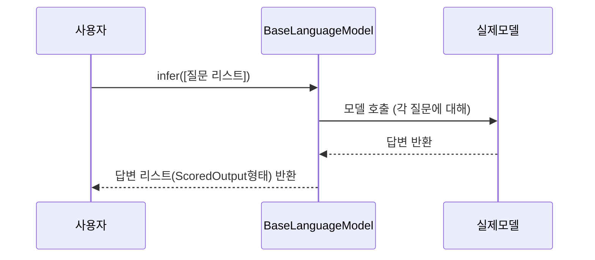

# Chapter 9: 언어 모델 추론 클래스 (BaseLanguageModel)

---

## 1. 이전 장과 이어서

지난 장에서는 [구조화된 출력 제약조건 및 스키마 추상 (BaseSchema & GeminiSchema)](08_구조화된_출력_제약조건_및_스키마_추상__baseschema___geminischema__.md)에서  
모델이 출력할 결과를 일정한 형식으로 엄격히 제한하는 스키마를 만들고 사용하는 방법을 배웠습니다.

이번 장에서는 바로 그 스키마와 함께 작동하는,  
실제로 언어 모델에 텍스트를 보내고 답변을 받아오는 **언어 모델 추론 클래스(BaseLanguageModel)**에 대해 알아보겠습니다.

---

## 2. 언어 모델 추론 클래스는 무엇일까?

컴퓨터가 글자를 쓰거나 읽도록 하려면 어떻게 할까요?  
바로 문장을 주고 답을 받는 작업입니다. 인공지능 언어 모델과 소통할 때도 마찬가지입니다.  

- 예를 들어 `"서울에서 태어난 사람은 누구인가요?"`라는 질문을 모델에 던지고,  
- `"홍길동"`이라는 답을 받는 과정을 추상적으로 다루는 클래스가 필요합니다.

`BaseLanguageModel`은 바로 이런 언어 모델과 소통하는 **기본 뼈대 역할을 하는 추상 클래스**입니다.  

> 쉽게 말해, 여러 종류의 인공지능 언어 모델과 고정된 '약속'으로 이야기할 수 있도록 만든 **공통 인터페이스**라고 생각하면 됩니다.

---

### 2-1. 왜 이렇게 추상 클래스를 쓸까?

- 서로 다른 회사, 다른 모델들은 사용하는 API 방식이나 출력 형식이 모두 다릅니다.  
- 하지만 프로그램에서 매번 다르게 쓰면 너무 복잡하고 관리하기 어렵습니다.  
- 그래서 `BaseLanguageModel`이라는 기본 틀을 만들어, 모든 모델이 따라야 하는 규칙(추상 메서드)을 정해놓고  
- 각 모델들은 이 클래스를 상속받아 자신에 맞는 코드를 구현합니다.

---

## 3. 주요 기능과 개념 쉽게 이해하기

### 3-1. `BaseLanguageModel` 클래스의 역할

- 언어 모델에 입력(프롬프트)을 주고  
- 출력(답변)을 받는 `infer()`라는 메서드를 정의(추상)합니다.  
- 스키마(`schema`)를 적용하여 모델 출력 형식을 제어할 수 있도록 합니다.  
- 여러 프롬프트를 한꺼번에 넘겨 **배치(batch) 처리**가 가능합니다.  
- 출력된 텍스트를 JSON이나 YAML 같은 **구조화된 형식으로 파싱**할 수 있습니다.

---

### 3-2. 핵심 메서드와 속성

- `infer(batch_prompts, **kwargs)`  
  - 여러 개의 질문(문장 리스트)을 넣으면, 모델에서 답변 리스트가 순서대로 나오는 제너레이터를 반환합니다.  
- `apply_schema(schema_instance)`  
  - 출력 형식을 제한하는 스키마를 모델에 적용합니다.  
- `set_fence_output(fence_output)`  
  - 출력 결과를 코드 블록(````json` 같은 펜스로 감쌀지 결정합니다.  
- `parse_output(output)`  
  - 모델이 준 문자열 답변을 JSON 또는 YAML 자료구조로 해석해 리턴합니다.  
- `merge_kwargs(runtime_kwargs)`  
  - 모델 실행 시 넘기는 옵션들을 병합해 줍니다.  

---

## 4. 간단한 사용 예시

```python
from langextract.inference import BaseLanguageModel, ScoredOutput

class MyDummyModel(BaseLanguageModel):
    def infer(self, batch_prompts, **kwargs):
        # 단순히 질문에 "답변"만 붙여 출력한다고 가정
        for prompt in batch_prompts:
            yield [ScoredOutput(score=1.0, output=prompt + "에 대한 답변입니다.")]

# 인스턴스 생성
model = MyDummyModel()

# 한 번에 여러 질문을 넣어 답변 얻기
for outputs in model.infer(["서울에 누가 살까요?", "오늘 날씨 어때요?"]):
    for output in outputs:
        print(output.output)
```

- 여기서는 아주 단순한 모형을 만들어  
- 질문에 `"~에 대한 답변입니다."`를 붙여서 답변을 흉내 냅니다.  
- 실제 모델과는 다르지만, `BaseLanguageModel` 인터페이스를 어떻게 쓰는지 감을 잡을 수 있습니다.

---

## 5. 내부 동작 흐름: 모델 추론 과정

아래 다이어그램은 한 번에 여러 질문을 넣고 답변을 받는 과정을 간단히 시각화한 것입니다.



1. 사용자는 여러 질문을 리스트로 넣어 `infer` 메서드를 호출합니다.  
2. `BaseLanguageModel`은 내부적으로 실제 모델에게 요청을 보내고 응답을 받습니다.  
3. 모델이 준 결과를 `ScoredOutput` 형태(점수와 텍스트)로 포장하여 반환합니다.  
4. 사용자는 반복문을 돌며 각 질문에 대한 답변을 받을 수 있습니다.

---

## 6. 내부 코드 핵심 개념 살펴보기

### 6-1. `ScoredOutput` 클래스

```python
@dataclasses.dataclass(frozen=True)
class ScoredOutput:
    score: float | None = None   # 출력 점수 (없을 수도 있음)
    output: str | None = None    # 출력 텍스트

    def __str__(self):
        return f"Score: {self.score}, Output: {self.output}"
```

- 답변과 함께 점수를 담는 간단한 데이터 구조입니다.  
- 예를 들어 모델이 여러 답변 후보 중 더 좋은 것에 높은 점수를 줄 때 사용합니다.

### 6-2. `BaseLanguageModel` 기본 구조

```python
class BaseLanguageModel(abc.ABC):
    def __init__(self, constraint=None, **kwargs):
        self._constraint = constraint or schema.Constraint()
        self._extra_kwargs = kwargs.copy()  # 추가 옵션 저장

    @abc.abstractmethod
    def infer(self, batch_prompts, **kwargs):
        # 모델 추론을 구현할 메서드
        raise NotImplementedError

    def parse_output(self, output):
        # JSON 또는 YAML로 파싱 시도
        try:
            # data.FormatType는 JSON 또는 YAML 중 선택
            format_type = getattr(self, 'format_type', data.FormatType.JSON)
            if format_type == data.FormatType.JSON:
                return json.loads(output)
            else:
                return yaml.safe_load(output)
        except Exception as e:
            raise ValueError(f"출력 파싱 실패: {e}")
```

- 추상 클래스이므로, `infer` 메서드는 구체 모델에서 반드시 구현해야 합니다.  
- 생성자에서 출력 제약조건이나 추가 옵션을 저장합니다.  
- `parse_output`으로 출력된 문자열을 쉽게 데이터로 변환할 수 있습니다.

---

## 7. `BaseLanguageModel` 활용 절차

1. **모델 클래스 구현**  
   - `BaseLanguageModel`을 상속받고 `infer()`를 구현합니다.  
   - 실제 API 호출이나 시뮬레이션 코드를 작성합니다.

2. **스키마 적용(Optional)**  
   - `apply_schema(schema_instance)`로 출력 제약조건을 설정하면  
   - 모델 동작에 제한을 두고 더 안정된 출력이 가능합니다.

3. **프롬프트 리스트 생성**  
   - 모델에 넘길 질문(프롬프트)를 미리 준비합니다.

4. **infer()로 프롬프트 보내기**  
   - 여러 개의 프롬프트를 한꺼번에 넘기고 결과를 받습니다.

5. **출력 파싱 및 처리**  
   - `parse_output()`으로 JSON 혹은 YAML 형태로 변환 후  
   - 원하는 곳에 데이터를 활용합니다.

---

## 8. 비유로 쉽게 이해하기

- `BaseLanguageModel`은 **언어 모델과 통하는 공통 약속서**와 같습니다.  
- 마치 여러 나라 사람들이 쓰는 번역기 같은 것으로,  
- 첫 번째 목적: 서로 다르게 생긴 기계라도 같은 버튼(메서드)으로 작동시키는 것.  
- 두 번째 목적: 텍스트 묻고 답하는 과정을 쉽게 표준화하는 것.

- 우리가 사용하는 실제 모델(예: Gemini, Ollama, OpenAI)은 이 약속을 지키는 각각 다른 ‘기계’들이고,  
- `BaseLanguageModel`이 그들을 ‘통합 관리하는 플랫폼’ 역할을 합니다.

---

## 9. 이번 장 요약 및 다음 장 예고

이번 장에서는

- **언어 모델과 소통하기 위한 기본 틀인 `BaseLanguageModel` 추상 클래스를 배웠습니다.**  
- 어떻게 여러 질문을 한꺼번에 모델에 보내고, 결과를 받는지,  
- 출력 결과를 JSON/YAML로 변환하는 방법도 함께 알게 되었습니다.  
- 또한 이 클래스가 다양한 공급자들이 따라야 할 공통 인터페이스 역할을 한다는 점을 이해했습니다.

다음 장에서는 이 `BaseLanguageModel` 클래스를 실제로 상속받아 만든 **Gemini, Ollama 등의 공급자 구현 사례**를 구체적으로 살펴보겠습니다.  
[다음 장 보기: 공급자 예시: Gemini 및 Ollama 공급자 구현](07_공급자_예시__gemini_및_ollama_공급자_구현_.md)

---

### 감사합니다! 다음 장에서 또 만나요 :)

---
