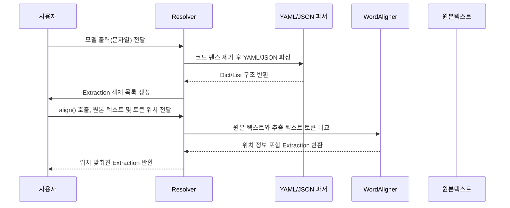

# Chapter 10: 추출 결과 해석기 및 정렬기 (Resolver)

---

## 1. 이전 장과 이어서

앞서 [언어 모델 추론 클래스 (BaseLanguageModel)](09_언어_모델_추론_클래스__baselanguagemodel__.md) 장에서는 언어 모델과 소통하는 추상 인터페이스를 배웠습니다. 이번 장에서는 언어 모델이 생성한 **텍스트 결과물**을 어떻게 다시 구조화된 데이터로 변환하고, 원본 문서 내 위치에 정확히 맞추는지 알아봅니다.  

즉, 모델이 낸 **문자열 답변을 해석(Parsing)하고, 정렬(Alignment)** 해서 우리가 원하는 `Extraction` 객체로 만드는 핵심 도구인 **Resolver**에 대해 쉽고 친절하게 설명합니다.

---

## 2. 왜 추출 결과 해석기 및 정렬기(Resolver)가 필요할까?

우리가 언어 모델에게 질문을 해서 답을 받으면, 보통은 JSON이나 YAML 같은 **구조화된 텍스트** 형태로 결과가 나옵니다. 그런데 여기서 끝나면 안 됩니다!  

예를 들어, 모델이 다음과 같이 대답했다고 해봅시다.

```yaml
extractions:
- 인물: 홍길동
  인물_index: 0
- 날짜: 2023-01-01
  날짜_index: 1
```

이 결과의 **문자열을 그냥 쓰기만 하면 안 되고**,  

- 이 결과를 `Extraction` 객체로 **파싱해서 변환**  
- 원본 텍스트 `"홍길동은 2023년 1월 1일에 태어났다."` 내에  
  `홍길동`과 `2023년 1월 1일`이 정확히 어디에 위치하는지 찾아서 해당하는 위치 정보를 넣어야 합니다.  
- 가끔 모델 출력이 완전히 문서와 일치하지 않거나 오타가 있어도,  
  **유사 단어 일치(퍼지 매칭)**를 시도해 최대한 위치를 맞춥니다.

이 역할을 하는 것이 바로 이번 장에서 다룰 **Resolver**입니다.  

> 쉽게 말해 **언어 모델 결과를 ‘번역’해서 정형화하고, 위치 맞춤을 해주는 ‘번역가 겸 편집자’**라고 이해하면 됩니다.

---

## 3. 핵심 개념 살펴보기

### 3-1. Resolver란?

- 모델에서 받은 JSON/YAML 문자열을 **파싱(parse)** 해서  
- `Extraction` 객체 목록으로 변환하고,  
- 원본 텍스트 내에서 해당 부분들이 어디인지 **정확히 위치를 맞춥니다.**  
- 필요 시 **퍼지 매칭(fuzzy matching)** 기법을 써서 완벽히 일치하지 않는 부분도 처리합니다.

### 3-2. 파싱(Parsing)

- Resolver는 모델 출력 문자열에서,  
- ```yaml 또는 ```json 같은 코드 펜스가 붙은 경우 이를 제거하고 안쪽 내용을 읽어냅니다.  
- YAML 또는 JSON 라이브러리를 이용해 딕셔너리 구조로 변환합니다.  
- 딕셔너리 안에서 `extractions` 키를 찾아 리스트 형태로 뽑아냅니다.  
- 각 추출 항목을 `Extraction` 객체로 바꿉니다.

### 3-3. 정렬(Alignment)

- `Extraction` 객체에 추출된 텍스트가 있지만,  
- 원본 `source_text`에 이 텍스트가 정확히 어디에 있는지 위치 정보가 없을 수 있습니다.  
- Resolver는 토큰 단위로 원문과 추출 텍스트를 비교해서  
- 완벽 일치하는 경우는 정확한 문자 범위와 토큰 범위를 붙입니다.  
- 완벽 일치가 없으면, 사소한 오타나 단어 차이도 감안해서 가장 유사한 위치를 찾아내는 퍼지 매칭을 시도합니다.

### 3-4. 인덱스 순서 및 속성 처리

- 출력에 인덱스 정보(`_index` 접미사 붙은 키)가 있다면, 이를 이용해 추출 항목들을 정렬합니다.  
- 각 추출 항목에 딸린 속성(`_attributes` 접미사 붙은 키)도 함께 수집해서 `Extraction` 내부 `attributes` 필드에 저장합니다.

---

## 4. Resolver를 사용해서 결과를 해석하고 정렬하기

### 4-1. 간단한 예시 입력 문자열 (모델 출력)

```yaml
```yaml
extractions:
- 인물: 홍길동
  인물_index: 0
  인물_attributes:
    역할: 주인공
- 날짜: 2023년 1월 1일
  날짜_index: 1
```
```

### 4-2. Resolver를 이용한 해석 예제

```python
from langextract.resolver import Resolver

resolver = Resolver(fence_output=True, format_type='yaml')

input_text = """
```yaml
extractions:
- 인물: 홍길동
  인물_index: 0
  인물_attributes:
    역할: 주인공
- 날짜: 2023년 1월 1일
  날짜_index: 1
```
"""

extractions = resolver.resolve(input_text)
for ext in extractions:
    print(f"종류: {ext.extraction_class}, 텍스트: {ext.extraction_text}, 속성: {ext.attributes}")
```

**실제 출력될 내용 설명:**  
- `extractions` 리스트에서 `Extraction` 객체를 만듭니다.  
- 각 항목에 인물/날짜 종류, 텍스트, 그리고 속성(역할: 주인공)이 포함됨을 확인할 수 있습니다.

---

### 4-3. 정렬 실행 예제 (원본 텍스트 위치 맞추기)

```python
source_text = "홍길동은 2023년 1월 1일에 태어났다."
aligned_extractions = list(
    resolver.align(
        extractions,
        source_text=source_text,
        token_offset=0,  # 청크 내 토큰 시작 인덱스
        char_offset=0,   # 청크 내 문자 시작 인덱스
        enable_fuzzy_alignment=True,
    )
)

for ext in aligned_extractions:
    print(f"종류: {ext.extraction_class}, 텍스트: {ext.extraction_text}, 위치(문자): {ext.char_interval}, 정렬상태: {ext.alignment_status}")
```

**이 코드는:**  
- 원본 문장에서 `홍길동`, `2023년 1월 1일`이 텍스트 어디에 있는지 찾아서  
- `char_interval`에 시작과 끝 위치를 저장합니다.  
- 퍼지 매칭 결과도 status로 알려줍니다 (정확히 일치하면 MATCH_EXACT).

---

## 5. 내부 동작 흐름 이해하기

Resolver가 어떻게 동작하는지 시퀀스 다이어그램으로 살펴봅시다.



1. 사용자(즉, Annotator 등)가 모델 출력 원본 문자열을 Resolver에게 줍니다.  
2. Resolver는 코드 펜스(````yaml`)를 제거하고, YAML/JSON 파서로 파싱합니다.  
3. `extractions` 리스트를 읽어 데이터를 `Extraction` 객체로 만듭니다.  
4. 사용자가 원본 텍스트와 위치 오프셋을 주면, `align()` 호출로 위치 정렬을 수행합니다.  
5. WordAligner가 토큰을 비교해서 위치 정보를 찾아줍니다.  
6. 위치가 포함된 완성된 `Extraction` 객체들이 리턴됩니다.

---

## 6. 내부 구현 심화 탐구 (간단 코드와 설명)

### 6-1. `resolve()` 내부 핵심 흐름

```python
def resolve(self, input_text: str, suppress_parse_errors=False):
    # 1. 문자열 내부의 YAML/JSON 데이터 파싱
    extraction_data = self.string_to_extraction_data(input_text)

    # 2. 추출된 dict 형태 데이터를 Extraction 객체 목록으로 변환
    processed_extractions = self.extract_ordered_extractions(extraction_data)

    return processed_extractions
```

- `string_to_extraction_data()`가 코드 펜스 안 내용을 읽고 dict로 파싱합니다.  
- `extract_ordered_extractions()`가 순서대로 Extraction 객체를 만들어 리스트로 반환합니다.

### 6-2. `string_to_extraction_data()` 핵심 부분

```python
def string_to_extraction_data(self, input_string):
    # 코드 펜스 제거 후 내용 부분 추출
    if self.fence_output:
        left = input_string.find("```" + self.format_type.value)
        right = input_string.rfind("```")
        content = input_string[left + len("```yaml") : right].strip()
    else:
        content = input_string

    # YAML 또는 JSON 파싱
    if self.format_type == data.FormatType.YAML:
        parsed_data = yaml.safe_load(content)
    else:
        parsed_data = json.loads(content)

    # 'extractions' 키 검색
    extractions = parsed_data[schema.EXTRACTIONS_KEY]
    return extractions
```

- 펜스 내에 있는 구조화된 내용만 뽑아서 파싱합니다.  
- 파싱 실패 시 별도의 예외 발생으로 외부에서 처리합니다.

### 6-3. `extract_ordered_extractions()` 내부

- 각 딕셔너리 키-값 쌍을 살펴봅니다.  
- `_index` 접미사가 붙은 키로 순서를 정하고,  
- 일반 키는 추출 종류와 텍스트로 변환합니다.  
- `Extraction` 객체를 생성해 리스트에 추가합니다.

```python
extractions = []
for group in extraction_data:
    for k, v in group.items():
        if not k.endswith(self.extraction_index_suffix):
            index = group.get(k + self.extraction_index_suffix, None)
            ext = Extraction(
                extraction_class=k,
                extraction_text=str(v),
                extraction_index=index,
            )
            extractions.append(ext)
extractions.sort(key=lambda e: e.extraction_index)
```

---

### 6-4. `align()`에서 WordAligner 호출 흐름

```python
def align(self, extractions, source_text, token_offset, char_offset, ...):
    aligner = WordAligner()
    aligned = aligner.align_extractions(
        [extractions], source_text, token_offset, char_offset, ...
    )
    for group in aligned:
        yield from group
```

- `WordAligner`가 실제 원문 토큰과 추출 텍스트 토큰을 비교하며 자리 맞춤을 시도합니다.  
- 정밀한 일치가 없으면, 미리 정의한 임계값 이상의 유사도를 기준으로 위치를 찾아줍니다.

---

## 7. 비유로 이해하기

- **파싱(Parsing)은** 모델 답변이라는 ‘책의 페이지’에서 ‘목차’와 ‘본문’을 찾아내어  
  체계적으로 정리하는 도서관 사서의 일과 같습니다.  
- **정렬(Alignment)은** 목차 속 중요한 단어가 책 전체 어디에 있는지 페이지 번호를 붙이는 작업과 같습니다.  
- 퍼지 매칭은, 철자가 살짝 틀렸거나 비슷한 단어도 인근 위치를 찾아 알려주는 ‘똑똑한 사서’ 역할이죠.

---

## 8. 이번 장 정리 및 다음 장 연결

이번 장에서는

- 언어 모델이 만든 문자열 형태의 결과를 파싱해  
- `Extraction` 객체 목록으로 변환하는 과정  
- 그리고 원본 텍스트 내에서 해당 위치를 최대한 정확히 맞추는 **정렬 과정**  
- 퍼지 매칭을 통한 불완전한 일치 처리 방법  

등을 배웠습니다.  

이는 [문서 및 청크에 대한 주석 처리 파이프라인 (Annotator)](04_문서_및_청크에_대한_주석_처리_파이프라인__annotator__.md)에서 모델 결과를 후처리하는 데 꼭 필요한 핵심 도구입니다.  

다음 장에서는 이렇게 만들어진 주석 결과를 시각적으로 확인할 수 있는 **추출 결과 시각화 도구**에 대해 배워보겠습니다.  

[다음 장 보기: 추출 결과 시각화 도구 (visualization.py)](11_추출_결과_시각화_도구__visualization_py__.md)

---

### 감사합니다! 다음 장에서 또 만나요 :)

---
