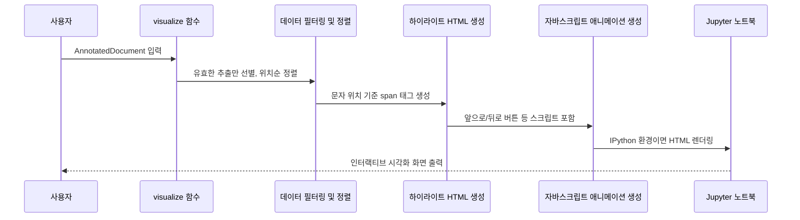

# Chapter 11: 추출 결과 시각화 도구 (visualization.py)

---

## 1. 이전 장과 이어서

앞서 [추출 결과 해석기 및 정렬기 (Resolver)](10_추출_결과_해석기_및_정렬기__resolver__.md) 장에서는  
모델이 생성한 텍스트 형태의 추출 결과를 파싱하고, 원본 문서 내 정확한 위치에 맞추는 방법을 배웠습니다.

이번 장에서는 이렇게 만들어진 추출 결과를 시각적으로 확인할 수 있도록 도와주는 **추출 결과 시각화 도구 (visualization.py)**를 다룹니다.  
특히 Jupyter 노트북 같은 환경에서 추출된 주요 정보들을 **형광펜으로 하이라이트된 것처럼 표시하며, 애니메이션과 툴팁 기능까지 지원하는 인터랙티브한 시각화 도구**에 대해 쉽게 설명합니다.

---

## 2. 왜 추출 결과를 시각화해야 할까?

정보 추출이 잘 되었는지 눈으로 직접 확인하고 싶을 때가 많습니다.  
예를 들어, 아래 문장에서 추출한 인물, 날짜, 장소 등이 정확히 어디에 위치하는지 알고 싶다면 협업 도구에 그냥 텍스트만 던져서는 어렵습니다.

> `"홍길동은 2023년 1월 1일에 서울에서 태어났다."`

추출 결과를 쉽게 확인하려면,

- 추출 정보별로 색깔을 달리하여  
- 텍스트 원문 위에 하이라이트하고  
- 마우스를 올렸을 때 속성 정보를 보여주며  
- 여러 추출 결과를 차례차례 애니메이션처럼 돌려보거나  
- 목차처럼 추출 유형별로 구분해 보고  

싶은 마음이 들죠.

이런 시각화 도구 덕분에,

- 추출 결과가 어디에 어떻게 잡혔는지  
- 추출이 잘못된 부분은 없는지  
- 속성 정보가 잘 들어갔는지  

직관적으로 확인할 수 있어 디버깅과 검증 작업이 훨씬 쉬워집니다.

---

## 3. 주요 개념 쉽고 간단하게 이해하기

### 3-1. **텍스트 하이라이트(Highlighting)**

- 원본 텍스트에서 추출된 구간을 `start_pos`와 `end_pos`로 기준 삼아  
- 각 구간을 서로 다른 색으로 배경색을 칠하여 눈에 띄게 표시합니다.  
- 여러 개체 타입(예: 인물, 날짜, 장소)에 따라 색상을 다르게 배정합니다.

### 3-2. **인터랙티브 애니메이션**

- 추출된 각각의 개체를 하나씩 차례대로 표시하거나 숨기며  
- 손쉽게 다음/이전으로 이동하는 버튼을 클릭할 수 있게 합니다.  
- 진행 상태를 슬라이더로 보여줘 원하는 위치로 빠르게 점프할 수도 있습니다.

### 3-3. **툴팁(Tooltips) 및 속성 정보**

- 각 하이라이트된 구간 위에 마우스를 올리면,  
- 해당 추출 정보의 상세 속성(예: 역할, 상세 설명 등)을 작은 팝업으로 보여줍니다.

### 3-4. **범례(Legend) 표시**

- 색상별로 어떤 개체 타입인지 알 수 있도록  
- 화면 상단에 작은 색상 박스와 함께 각 개체명을 보여줍니다.

### 3-5. **Jupyter 노트북 환경 지원**

- Jupyter 노트북에서 바로 실행하면 HTML과 자바스크립트 애니메이션으로 보여줍니다.  
- IPython이 없거나 일반 스크립트 환경에서는 그냥 HTML 문자열만 반환합니다.

---

## 4. 어떻게 사용하는가? 간단한 예제

다음은 `langextract`에서 추출 결과를 시각화하는 아주 간단한 코드입니다.

```python
import langextract as lx

# 1. 문서 및 추출 결과 생성 (간단히 예시)
doc = lx.extract("홍길동은 2023년 1월 1일에 서울에서 태어났다.")

# 2. 시각화 실행
html_result = lx.visualize(doc)

# 3. Jupyter 환경이라면 HTML이 바로 렌더링 됩니다.
print(html_result)  # HTML 문자열 출력 (터미널 등에서는 이렇게 확인)
```

- `lx.extract()`는 앞서 배운 `Annotator` 등으로부터 나온 `AnnotatedDocument` 객체를 반환한다고 가정합니다.  
- `lx.visualize()` 함수는 이 문서 안의 추출 결과를 받아서 인터랙티브 HTML로 변환해 줍니다.  
- Jupyter 노트북이면 바로 하이라이트된 텍스트와 애니메이션 컨트롤이 화면에 나타납니다.

---

## 5. 내부 동작 흐름 이해하기

이번에는 시각화 함수가 어떤 흐름으로 동작하는지 간단한 시퀀스 다이어그램으로 살펴봅시다.



- 사용자는 추출 결과가 포함된 문서를 입력합니다.  
- 먼저 정상적으로 위치 정보가 있는 추출 항목만 골라내고, 위치에 따라 정렬합니다.  
- 원본 텍스트를 기준으로 `<span>` 태그를 쳐서 하이라이트를 삽입합니다.  
- 자바스크립트로 애니메이션 관련 버튼과 슬라이더, 툴팁 코드를 만듭니다.  
- Jupyter 노트북이면 시각적으로 바로 보여주고, 아니면 HTML 문자열을 출력합니다.

---

## 6. 내부 구현 탐구

### 6-1. 색상 할당 함수

```python
def _assign_colors(extractions):
    classes = {e.extraction_class for e in extractions if e.char_interval}
    palette_cycle = itertools.cycle(_PALETTE)
    color_map = {cls: next(palette_cycle) for cls in sorted(classes)}
    return color_map
```

- 추출된 개체 유형별로 미리 정의된 색상 팔레트에서 순환하며 색을 할당합니다.  
- 색상은 클래스명이 같으면 항상 동일하게 유지됩니다.

### 6-2. 텍스트 하이라이트 생성

```python
def _build_highlighted_text(text, extractions, color_map):
    points = []
    for idx, e in enumerate(extractions):
        start = e.char_interval.start_pos
        end = e.char_interval.end_pos
        points.append((start, 'start', idx))
        points.append((end, 'end', idx))
    points.sort(key=lambda x: (x[0], 0 if x[1]=='end' else 1))
    
    result_html = []
    cursor = 0
    for pos, tag, idx in points:
        if cursor < pos:
            result_html.append(html.escape(text[cursor:pos]))
        if tag == 'start':
            color = color_map.get(extractions[idx].extraction_class, '#ffff8d')
            result_html.append(f'<span style="background-color:{color};" data-idx="{idx}">')
        else:
            result_html.append('</span>')
        cursor = pos
    if cursor < len(text):
        result_html.append(html.escape(text[cursor:]))
    return ''.join(result_html)
```

- 추출 구간의 시작 및 끝 위치 정보를 모아 `start`는 열고, `end`는 닫는 `<span>` 태그를 삽입합니다.  
- 탭, 개행 등도 포함해서 원본 텍스트 그대로 HTML로 생성합니다.  
- 위치가 겹쳐도 올바른 중첩 구조를 유지합니다.

### 6-3. 애니메이션용 자바스크립트 생성

- 추출된 각 영역을 대상 인덱스별로 컨트롤 할 수 있는  
- `play`, `pause`, `앞/뒤로 이동`, `슬라이더 진척도 조정` 기능을 하는 자바스크립트 코드를 미리 만들어 넣습니다.

- 마우스오버 시 동작하는 툴팁 팝업도 이 JS가 제어합니다.

### 6-4. 전체 HTML 및 CSS 템플릿

- CSS 스타일은 하이라이트 색상, 툴팁 스타일, 버튼 모양, 애니메이션 효과 등을 포함합니다.  
- HTML 구조는 텍스트 하이라이트 영역, 속성 표시 영역, 조작 버튼과 상태 표시 영역으로 구성됩니다.

---

## 7. 비유로 더 쉽게 이해하기

- 시각화 도구는 **책에 형광펜을 칠하는 일러스트레이터**와 같습니다.  
- 중요한 문장이나 이름, 날짜에 색을 입히고, 그 구역 위에 귀여운 메모지를 붙여둡니다.  
- 그리고 읽는 사람이 손쉽게 ‘다음 형광펜’으로 넘어가거나, 원하는 구간으로 바로 갈 수 있는 네비게이션을 만들어 줍니다.  
- 이런 과정을 통해 독자는 책 내용을 빠르게 훑어보면서 필요한 정보를 정확히 찾을 수 있죠.  

---

## 8. 이번 장 요약

이번 장에서는

- 추출 정보 결과를 원문 텍스트에 색상별로 하이라이트해 보여주는 기술  
- 마우스오버 툴팁으로 상세 정보를 확인하는 방법  
- 애니메이션, 버튼, 슬라이더로 추출 구간을 손쉽게 넘기는 인터랙티브 기능  
- Jupyter 노트북에 최적화된 HTML 렌더링까지  

포함한 **추출 결과 시각화 도구**를 배웠습니다.

---
